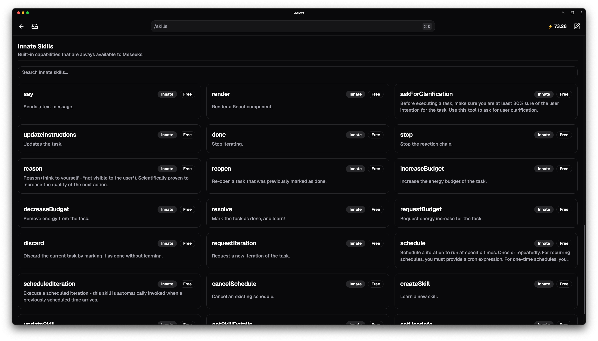
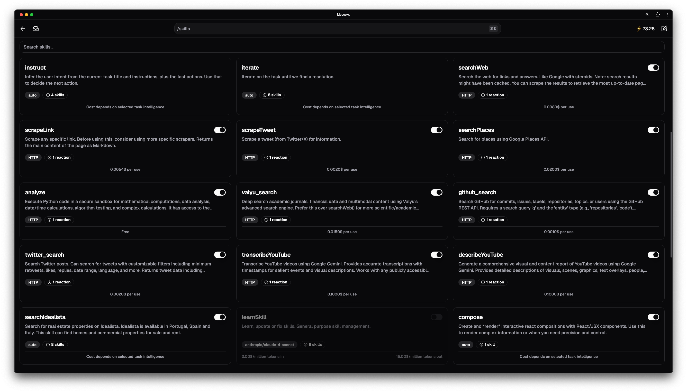
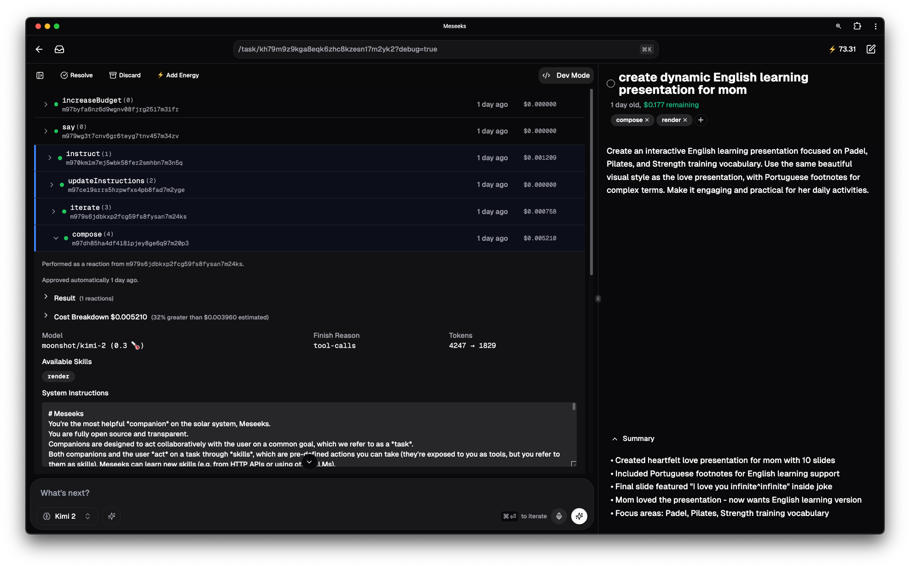

<div align="center">
  <br />
  <br />
  
  <br />
  <br />
</div>

# Look at me!

Meseeks is **the first companion** — AI systems designed for long-term collaborative work. Their goal is to replace your ToDo app, email client, Slack, or whatever you juggle to get things done.

Throw in a task and it'll partner with you to achieve it.

Organizing and expanding ideas, breaking down complexity, composing reports and presentations, sending emails, and whatever else your need — given that companions learn on the fly by trial and error (like you and me), gradually adapting to how you think, talk and act.

Companions are [*that thing*](https://www.youtube.com/shorts/-B3j7NtqU5o) where you empty your mind at and rest in peace that it'll be handled — even if it requires you!

Early on it **sort of feels like onboarding a new team member.** There is a lot of explaining and time investment; but overtime more and more gets absorbed, naturally earning your trust and gaining autonomy.

Eventually, delegating entire projects are just a few words away.

**Escape velocity has been reached. <br />**
Enjoy the ride!

>*Start scaling your decision-making today at [meseeks.app](https://meseeks.app).* Be free!

[See it in action 👇](#-compositions)

## Platform vs App

This repository is actually two things:

**1. An open companion platform** - This entire repository is a reactive platform. It comes with innate skills like say(), reason(), render() and many others, but no managed skills like searching the web or scraping links (which relly on third-party services).

It's purely the infrastructure. The **reactor** mechanics for assembling skill-based reaction chains, managing tasks, energy-controlled autonomy, and more. You add your own skills and loops, and make it behave the way you want. It can act like a chatbot (chatgpt), an agent (cursor, lovable), a deep researcher, or whatever else you want.

**2. Meseeks, the app** - Our research preview available at [meseeks.app](https://meseeks.app).

This is our cloud offering of the platform that comes with a bunch of managed skills like web searching with [Tavily](https://www.tavily.com), YouTube transcribing with Gemini, link scraping with [Firecrawl](https://firecrawl.dev), academic research with [Valyu](https://valyu.network), and many many more.

We make a fixed amount of money per subscription. After that, **you pay exactly what these services cost us** - zero markup.

## Features

### 🧱 Skills

The building blocks of Meseeks — they define what it can do.

- **Hard skills**: Use HTTP to talk to other apps and external services. No MCP required.
- **Soft skills**: AI-powered decision making. Any model, any provider.
- **Innate skills**: Built-in capabilities like say(), reason(), render(), schedule(), updateInstructions(), and many others.
- **Community skills**: Share and discover skills from other users (coming soon).

When a skill is used, we call it an **action**. This can be performed directly by the user, or by Meseeks (via a soft skill re-action).

<div align="center">
  
</div>

### 🧪 Reactor

Every time an action is performed, it may trigger a re-action, that may trigger another re-action, and so on. We refer to that as the **reaction chain**.

- **Keep execution under control** with energy ⚡ budgeting, avoiding machines to take over.
- **Learn new skills** during task execution.

<div align="center">
  
</div>

### 🎨 Compositions

Allows Meseeks to render React-based code. The use cases are endless.

- **Live dashboards** that update in real-time.
- **Presentations** like slides, videos, charts, etc.
- **Games** from tic-tac-toe to complex 3D. Whatever runs in the browser.
- **Shareable** with embedded functionality (coming soon).

<div align="center">
  <video src="https://github.com/user-attachments/assets/8a30875e-8ced-4615-86ae-1d210b0e1514" controls width="75%" />
</div>
<!-- im a hacker https://github.com/orgs/community/discussions/19403#discussioncomment-8432916 -->

>Very soon Meseeks will allow you to update it's own UI 🤯

### ⚡ Energy

The effort unit on Meseeks is called **energy** (or simply ⚡), which is equivalent to the US dollar, i.e. **1 energy = $1**. Energy supports up to 10 decimal places, so actions can cost as few as 0.0000000001⚡ (or 0).

Energy is used to pay for AI compute and any other services (e.g. 0.008⚡ per web search with Tavily). Note that **we have ZERO markup on any of these services**, you pay exactly what they cost us.

We make a fixed amount of money per subscription, which includes **unlimited usage of the platform and all it's innate skills**. Skills that you teach it yourself are also **free of charge**.

**Very soon users will be able to share and earn from their skills.** If you are interested in participating in the early access program, please hit the share button on any of your personal skills and apply.

<div align="center">
  <video src="https://github.com/user-attachments/assets/3187f688-a0e4-4ad4-a1c4-2f7f54608b61" controls width="75%" />
</div>
<!-- im a hacker https://github.com/orgs/community/discussions/19403#discussioncomment-8432916 -->

Tasks have an **[autonomy slider](https://youtu.be/LCEmiRjPEtQ?t=1269)**, which controls how independent Meseeks is. You can also have tasks with 0 energy and handle everything yourself.

### 🧑‍💻 Dev Mode

Transparency is a foundational principle of Meseeks, so you can always hit the `Dev Mode` button to see *everything* that's going on. Every token, every word, every byte, every cost, everything.

<div align="center">
  
</div>

## 🚀 Running locally

We haven't yet spent much energy making it easy to run locally, but it should be as straightforward as filling up the environment variables and initialize Convex — which should take a couple minutes at most. We expect to have a full tutorial/guide soon.

### Codex branch preview

Use normal local development when you want the personal Convex dev deployment:

```sh
bun dev
```

Use a branch preview when a Codex worktree needs its own backend:

```sh
bun preview
```

If the worktree is detached, pass the branch explicitly:

```sh
bun preview -- --branch my-branch
```

`bun preview` selects or creates `preview/<branch>`, writes `apps/meseeks/.env.local`, generates local Convex types with the repo-pinned CLI, deploys functions/schema to that exact preview backend with `--preview-name`, and exits. It does not start Vite or keep the terminal open.

Start the frontend separately when you want to use that preview backend:

```sh
bun dev:web
```

Or use the combined command when you intentionally want one terminal to deploy the preview backend and then stay open as the Vite server:

```sh
bun preview:dev
```

Frontend changes use Vite HMR while `dev:web` or `preview:dev` is running; backend changes require rerunning `bun preview` or `bun preview:dev`.

Fresh preview backends are seeded with `internal.seed._all` during the first preview deploy. Set `CONVEX_PREVIEW_RUN=none` to skip that, or set it to another function name if the preview needs a different seed. Vercel preview deploys use the same branch preview name instead of recreating a random backend.

### Self-Hosting Options

You can run Meseeks entirely offline on your own infrastructure:

- **Fully Local**: Run Convex on your machine with open source databases (e.g. Postgres), use local AI models if your hardware supports them.
- **Hybrid Cloud**: Mix and match services - use Convex's free tier, Google Gemini's free tier, and others to minimize costs.
- **Your Own Server**: Deploy everything to your own servers with complete control.

### AGPL-3 License Benefits

Meseeks is licensed under **AGPL-3**, which means you can do essentially anything with it:
- Clone, rebrand, and resell it
- Modify it for any need
- Run it locally or on servers
- Compete with us (we'd love that!)
- Literally anything

**As long as you keep it open source.** Any modifications, even for internal use, must be open.

## 🛠️ Tech Stack

Meseeks is **end-to-end open**, i.e. every piece it relies on is also open source. From the backend core to the payment processor — no closed pieces.

The foundational pillars are:
- **[Convex](https://github.com/get-convex/convex-backend)** - Real-time backend. Abstracts database complexity and provides the perfect building blocks for AI.
- **[TanStack/Everything](https://tanstack.com/)** - Start, Router and Query to power our frontend.
- **[AI SDK](https://github.com/vercel/ai)** - Multi-provider AI integration enabling seamless model switching.

### 🫶 Open Source 🫶

We're extremely grateful to the open source community. The massive efficiency gains we're seeing in the industry today are only possible because of incredible open source libraries collectively built and maintained by **millions of engineers around the globe**.

AI couldn't write as much code as it does today without every layer below it. Think about how Tailwind, shadcn/ui, TanStack, and others are literally part of every LLM knowledge nowadays. Every model can write excellent React code, handle complex TypeScript types, and use useQuery/useMutation to its full extent.

Convex provides the most important building blocks for AI applications, abstracting backend complexity, ensuring proper indexing, enforcing schema conformance with Zod, and making everything safe, fast, and scalable by default.

**It's our mission to give back to the community that made all of this possible.**

Meseeks has 1 listed contributor on GitHub, **but it's truly made by decades of human collaboration.**

## 🤝 Contributing

We have 1 single rule: we don't use or support anything Microsoft. Everything else is acceptable, just open a pull request 😁

- **Bun**: We use `bun` instead of npm/yarn/pnpm.
- **TypeScript**: Everything must be type-safe (no `any`).

## 🚢 Deployment

Just plug into Vercel and everything works out of the box.

## ⚠️ Disclaimer

**Meseeks is a tool and, therefore, cannot be held accountable.** It takes actions **on your behalf**, meaning you are responsible for any outcomes.

To guarantee that, Meseeks is designed to be fully traceable, i.e. every action is traceable to a human decision that triggered it, directly or through a chain of reactions. **By using Meseeks, you agree that you are responsible for all outcomes of your actions.**

If it earns money, it's yours. If it causes damages, you pay.

Meseeks allows you to operate at infinite scale. **Be responsible.**

## 📄 License

This project is licensed under the **AGPL-3.0 License** - see the [LICENSE.md](LICENSE.md) file for details.

You can do literally anything with it, **as long as you keep it open source.**

## 🌟 Community & Support

- **Twitter**: [@MeseeksApp](https://x.com/MeseeksApp) and  [@igor9silva](https://x.com/igor9silva)
- **GitHub**: [Issues](https://github.com/igor9silva/meseeks/issues/new)
- **Discord**: [Server](https://discord.gg/nmagFVGvfE)
- **Learn more**: [Vision blog post](https://igorsilva.pro/agi)

## Thank you everyone!

Meseeks is built collaboratively by the open-source community, and stands on the shoulders of projects like [Convex](https://github.com/get-convex/convex-backend), [TanStack](https://tanstack.com/), [AI SDK](https://github.com/vercel/ai), [Tailwind](https://github.com/tailwindlabs/tailwindcss), [shadcn/ui](https://github.com/shadcn-ui/ui), [Polar](https://github.com/polarsource/polar), and many, maaaaany others.

---

<div align="center">
  <!-- <strong>Look at me! I'm Mr. Meseeks!</strong><br/> -->
  <sub>Built with ❤️ by humankind.</sub>
</div>
