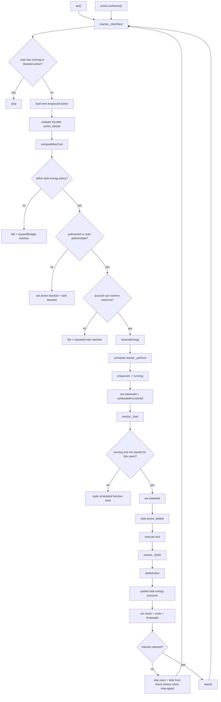

# Reactor

The reactor is the internal execution loop for task actions.

Its job is to claim one runnable action per task, prepare durable execution details, reserve account energy, run non-cancellable work, settle the reservation, persist the terminal result, and continue the queue. Action-owned concerns stay in `action.ts` and `action.private.ts`; reactor-owned concerns stay in `reactor.ts`, `reactor.private.ts`, and focused reactor helpers.

## Lifecycle

## Budget Model

`task.energyBudget` is policy, not an account wallet. `total` is the user-approved task energy target, and `available` is remaining policy energy. `available` may go negative inside the configured in-memory buffer, which creates pressure for the model to stop or ask for more energy. The buffer is never rendered into model context.

Actual accounting happens through action-local reservation fields and user account transactions. `maxCost` is the worst-case action cost without buffer. `reservedEnergy` is the account hold created before scheduling paid work. `_finish` settles the difference between `reservedEnergy` and actual `costs`, supporting both positive releases and negative overage charges.

## Statuses

`enqueued` means the action exists but does not own the execution slot.

`running` means the reactor owns the execution slot. If `claimedAt` is set and `startedAt` is missing or older than `claimedAt`, the action is claimed and scheduled but `_perform` has not started real work for the current claim yet.

`blocked` means claim reached a human authorization boundary and the queue must pause until the user resolves it.

`succeeded`, `failed`, and `skipped` are terminal statuses.

## Timestamps

`_creationTime` is the enqueue time from Convex.

`claimedAt` is when `_claimNext` reserved the action execution slot.

`reservedAt` is when account energy was reserved for the action.

`startedAt` is when `_start` marked the current running claim as actually started.

`authorizationRequestedAt` is when the reactor paused the action for authorization.

`approvedAt` is the legacy persisted field for when authorization was granted.

`interruptedAt` is when a started action was superseded by a new human action. Started actions are assumed non-cancellable, so interruption hides the result from future history and prevents `react()`, but does not skip financial settlement.

`settledAt` is when the action reservation was settled.

`finishedAt` is when the action reached a terminal status.

These fields represent the latest attempt for an action. Full attempt history belongs in action events later, not in the action document.

## Reaction Triggers

`reactionTrigger` is action-local continuation state, not a loop id. `finish` means the action may call `react()` when it finishes. `none` means the action can run and finish normally but must not create reactions.

`act(loop: "seek")` creates user actions with `reactionTrigger: "finish"` and cancels existing companion work. Pending companion actions are skipped. Started running work is marked with `interruptedAt`, finishes financially with its real status and costs, and cannot react.

`act(loop: "silent")` creates user actions with `reactionTrigger: "none"` and does not cancel the existing companion chain. Later actions will see the silent action if it is part of rendered context, but the silent action itself does not continue the loop.

## Invariants

Only one `running` action may exist per task in normal operation.

A `blocked` action blocks same-depth or deeper work. Lower-depth enqueued actions may run so silent steering can proceed while an older chain waits.

`_claimNext` is the only reactor entrypoint that moves `enqueued -> running`. It must prepare `action_details`, compute `maxCost`, pass policy/account/authorization gates, reserve energy, schedule `_perform`, and set `claimedAt`.

`_start` is the only reactor entrypoint that sets `startedAt`.

`_perform` must no-op when `_start` reports a stale action. Scheduler arguments are only a pointer to work that was valid when scheduled; the current action document is the authority. A running action is stale for `_start` when `startedAt` is already newer than or equal to `claimedAt`.

`_finish` is the only reactor entrypoint that persists successful or failed runtime completion, settles action energy, updates task energy pressure, and calls `react()`.

User stop paths may move unstarted actions to `skipped` for free. Started actions must finish financially; interruption is represented with `interruptedAt` and hidden from future history rendering.
