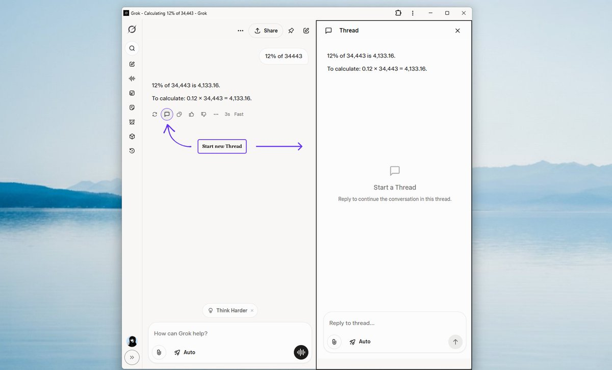

UX notes from Grok.com.

The interaction pattern is a "new thread from here" affordance: keep the current chat intact, but let the user branch into a fresh parallel thread without losing their place

## Additional Notes

- threads
- pinning
- sharing
- favicon (it looks different on Arc vs Safari)
- history UI on a convo
- ...

## Source

- URL: https://x.com/amXFreeze/status/1970542330831876165
- Author: [@XFreeze](https://x.com/XFreeze)
- Posted: `2025-09-23T17:34:37.000Z`
- Text: "Start a fresh Thread in Grok without disrupting your current chat"
- Summary: Grok shows a same-page UX for starting a fresh thread while continuing from the current context in parallel.
- Engagement at scrape time: 4,785 likes, 865 reposts, 673 replies, 43 quotes, 438 bookmarks, 1,765,443 views.

## Attachments

- [g1jfzota8aain-h.jpg](attachments/g1jfzota8aain-h.jpg) (55,673 bytes)

## TickTick source

- Project: `Meseeks (66b35a9a617f11216a574648)`
- List tag: `ticktick-list:meseeks`
- Task id: `68d2e1f6a3fd119de6619c26`
- Column: `Inbox (66b9091be0871102361203fc)`
- Status tag: `ticktick-status:inbox`
- Priority: `5`
- Created: `2025-09-23T18:07:50Z`
- Updated: `2025-09-27T11:50:24Z`
