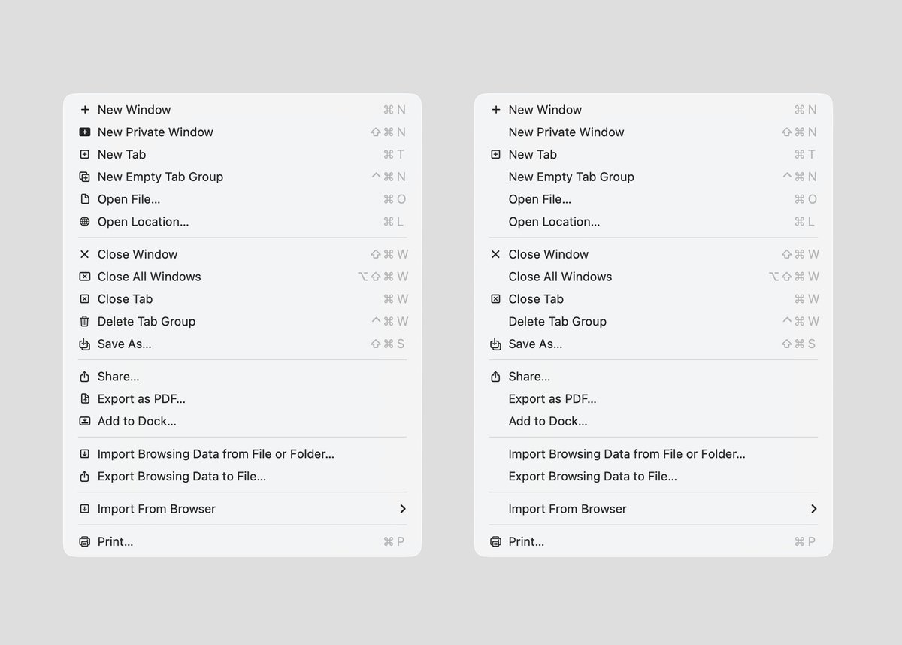

Use icons in menus and context menus as contrast signals, not decoration on every row. If every command gets an icon, the icons stop helping users scan for the actions they actually use.

Ruben Hume's example compares macOS Tahoe's icon-heavy menus with a stricter menu where only high-frequency actions carry icons.

## Source

- [Ruben Hume on X](https://x.com/rubenhume/status/2044275775160103077?s=20)
- Image: [tweet media](https://pbs.twimg.com/media/HF3CzaWXcAAWls5.jpg)
