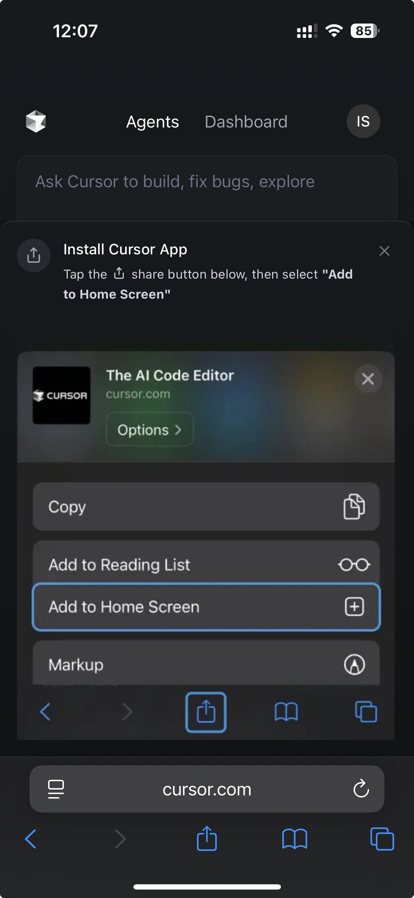

UX reference from Cursor's PWA install flow.

- installation instructions are shown after sign-in
- installed app stays signed in
- no iOS bounce

## Attachments

- [3afcbe26-fc60-4e27-aac0-3b08e25c8335.png](attachments/0a4bba2f-3afcbe26-fc60-4e27-aac0-3b08e25c8335.png) (640984 bytes)

## TickTick source

- Project: `🧞‍♂Meseeks (66b35a9a617f11216a574648)`
- List tag: `ticktick-list:meseeks`
- Task id: `68639fd948f2510336025a98`
- Column: `User Interface (67743b2f231fd1e84fc9c1fe)`
- Status tag: `ticktick-status:user-interface`
- Priority: `0`
- Created: `2025-07-01T08:44:09Z`
- Updated: `2025-07-01T11:09:33Z`
- Sort order: `-9222794348823630000`
