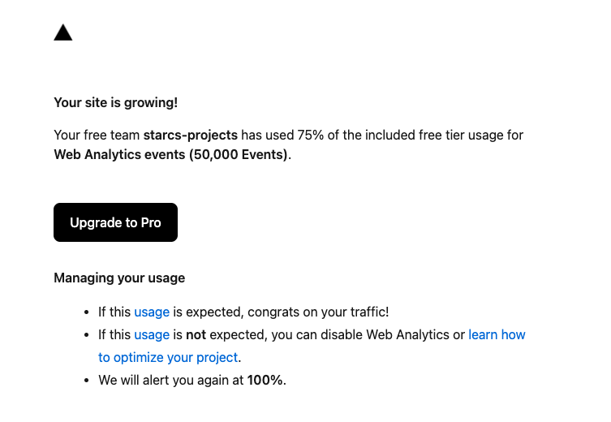

https://beui.dev/
[Saurabh | NodeOps (@saurra3h) on X](https://x.com/saurra3h/status/2069032069125251475?s=12)

## beUI website backup

Source: https://beui.dev/

Title: beUI · The motion toolkit for React & Next.js

URL Source: https://beui.dev/

Markdown Content:
[beUI](https://beui.dev/)[Components](https://beui.dev/components/motion)[Blocks](https://beui.dev/components/blocks)[Playground](https://beui.dev/playground)[Sponsors](https://beui.dev/sponsors)

Search⌘K[Github 489](https://github.com/starc007/ui-components)

[59 components · Tailwind 4 + React 19](https://github.com/starc007/ui-components)

# The motion toolkit for React&Next.js

Copy-paste animated components built on Framer Motion and Tailwind. Free and open source.

[Browse components](https://beui.dev/components/motion)[GitHub](https://github.com/starc007/ui-components)

Built on Framer Motion. Distributed via shadcn.

bun

npm

pnpm

yarn

$ bunx --bun shadcn add @beui/button-base button-base b u t t o n-b a s e

New

## Recently launched.

[](https://beui.dev/components/motion/select)

### Select

New

Next.js

*   Next.js
*   Remix
*   Astro
*   Vite

Composable select primitives whose panel bouncily unfolds out of the trigger and separates, plus a Morph variant where the trigger grows into the panel via shared layout.

[](https://beui.dev/components/motion/checkbox)

### Checkbox

New

Accept terms and conditions Email me product updates Select all (partial) Disabled 

Form choice control with a draw-on checkmark, spring press feedback and indeterminate state support.

[](https://beui.dev/components/motion/radio)

### Radio Group

New

Starter — free Pro — $12/mo Team — $29/mo Legacy plan 

Single-select choice control with a gliding layoutId indicator dot and spring press feedback.

[](https://beui.dev/components/motion/range-slider)

### Range Slider

New

Drag the handle 40

Range slider with tick dots and a bouncy vertical-bar thumb that glides between snapped steps; drag and keyboard control, reduced-motion safe.

[](https://beui.dev/components/motion/table)

### Table

New

10,000 rows

|  | Name | Email | Role | Status | MRR |  |
| --- | --- | --- | --- | --- | --- | --- |
|  | Leo Marsh | leo.marsh211@beui.dev | Admin | suspended | $499 |  |
|  | Jude Reyes | jude.reyes699@beui.dev | Admin | active | $499 |  |
|  | Ren Quinn | ren.quinn1187@beui.dev | Admin | invited | $499 |  |
|  | Eli Sato | eli.sato1675@beui.dev | Admin | suspended | $499 |  |
|  | Kai Frost | kai.frost2163@beui.dev | Admin | active | $499 |  |
|  | Leo Marsh | leo.marsh2651@beui.dev | Admin | invited | $499 |  |
|  | Jude Reyes | jude.reyes3139@beui.dev | Admin | suspended | $499 |  |
|  | Ren Quinn | ren.quinn3627@beui.dev | Admin | active | $499 |  |
|  | Eli Sato | eli.sato4115@beui.dev | Admin | invited | $499 |  |
|  | Kai Frost | kai.frost4603@beui.dev | Admin | suspended | $499 |  |
|  | Leo Marsh | leo.marsh5091@beui.dev | Admin | active | $499 |  |
|  | Jude Reyes | jude.reyes5579@beui.dev | Admin | invited | $499 |  |
|  | Ren Quinn | ren.quinn6067@beui.dev | Admin | suspended | $499 |  |
|  | Eli Sato | eli.sato6555@beui.dev | Admin | active | $499 |  |
|  | Kai Frost | kai.frost7043@beui.dev | Admin | invited | $499 |  |
|  | Leo Marsh | leo.marsh7531@beui.dev | Admin | suspended | $499 |  |
|  | Jude Reyes | jude.reyes8019@beui.dev | Admin | active | $499 |  |
|  | Ren Quinn | ren.quinn8507@beui.dev | Admin | invited | $499 |  |
|  | Eli Sato | eli.sato8995@beui.dev | Admin | suspended | $499 |  |
|  |

Virtualized data table that stays smooth at 10k+ rows, with sortable headers, row selection, column resize and reorder, and a sticky header. Minimal, reduced-motion-safe motion.

[](https://beui.dev/components/motion/shader-background)

### Shader Background

New

Mesh

Grain

Grain — Sunset

Grain — Pastel

Mesh — Aurora

Mesh — Citrus

Warp

Waves

Voronoi

Swirl

Orbit

Grid

Smoke

Radial

Neuro

Water

Metaballs

Rays

Spiral

Dither

Pulse

Panels

Static Mesh

Static Mesh — Dusk

Radial — Ember

Simplex

Perlin

Canvas shader backgrounds (mesh gradient, grain, warp, waves, voronoi, dot orbit and more) with a single typed variant prop. Reduced-motion freezes animated variants.

[](https://beui.dev/components/motion/cylinder-carousel)

### Cylinder Carousel

New

Concave

Convex

Drag, scroll or use arrow keys to roll

A carousel whose items line the inside of a cylinder, receding into the center and growing toward the edges. Drag, scroll or arrow-key to roll it, with a springy glide and snap. Reduced-motion drops the glide.

[](https://beui.dev/components/blocks/wallet-card)

### Wallet Card

New

Main Wallet Trading Cold Storage

Main Wallet

Balance

$12,480.32$12,480.32$1 2,4 8 0.3 2

+$124.50

Send Deposit Swap Buy

Simulate balance change

Wallet overview card with an account switcher and search that morph open from their triggers, a cascading balance with a live change pill and privacy toggle, copy-address, and Send / Deposit / Swap / Buy actions.

[](https://beui.dev/components/blocks/bloom-menu)

### Bloom Menu

New

Create

A button that morphs open into a menu and blooms iris-out from the center, the grid revealing in every direction with radially staggered items.

[](https://beui.dev/components/blocks/feedback-widget)

### Feedback Widget

New

Corner trigger that morphs open into a feedback popup with message entry and animated sending, success and retry states.

Components

## Motion primitives.

[Browse all](https://beui.dev/components/motion)

[](https://beui.dev/components/motion/button)

### Button

Continue Download Outline Ghost

Small Medium Large

Ripple Tap me

Spring-pressed Button plus StatefulButton (idle → loading → success / error) and MagneticButton.

[](https://beui.dev/components/motion/morphing-modal)

### Morphing Modal

Open wallet options
Click a row. The modal morphs height to match new content.

Family-app-style modal. A single panel that morphs its height as you navigate between inner views, with blur cross-fade on content.

[](https://beui.dev/components/motion/animated-toast-stack)

### Animated Toast Stack

Open a real toast

Toasts render fixed on the screen. Change position to open a toast from that edge.

Promise Success Error Clear

top-left top-center top-right bottom-left bottom-center bottom-right

Stacked toasts with status morphs, swipe dismissal, actions and layout-aware motion.

[](https://beui.dev/components/motion/action-swap)

### Action Swap

Copy link Copy link

CTA button and slot primitives for swapping text and icons with blur motion.

[](https://beui.dev/components/motion/dock)

### Dock

macOS-style dock with grouped actions and a gliding active pill.

[](https://beui.dev/components/motion/tabs)

### Tabs

Pill

Overview

Activity

Settings

High-level summary.

Recent events.

Preferences.

Segment

Day

Week

Month

Underline

All Open Closed

Pill, segment or underline tabs with a spring layoutId indicator.

[](https://beui.dev/components/blocks/dynamic-island)

### Dynamic Island

9:41

Call Timer Music Dismiss

iOS-style island pill that morphs between live activity views with bouncy shell resize and blur crossfades.

[](https://beui.dev/components/blocks/command-palette)

### Command Palette

Open command palette
Press ⌘ J (or Ctrl J) to open.

⌘K palette with fuzzy filter, spring-animated active row and glass surface.

[](https://beui.dev/components/blocks/expandable-action-bar)

### Expandable Action Bar

Send S Copy C Export E Archive Alerts 3 Settings

Expand

Compact icon actions that expand into labeled controls on hover or focus with shared layout motion.

[](https://beui.dev/components/blocks/expandable-tabs)

### Expandable Tabs

Release Brief Launch Checklist Campaign Notes Rollout Calendar Ship Build

Client Feedback Team Requests Approval Notes

Trigger Map Webhook Runs Retry Queue

Brand Kit Mockup Library Design Tokens Export Queue

Activation Conversion Incidents

Launch Inbox Flows Assets Status

Launch Inbox Flows Assets Status

Icon tab bar where the active tab expands to a labelled pill, with a panel above that morphs height and slides content direction-aware on switch.

[](https://beui.dev/components/motion/tilt-card)

### Tilt Card

Premium

### Tilt me

Move your cursor across the card to see 3D tilt + glare.

3D perspective tilt on hover with cursor-tracked glare.

[](https://beui.dev/components/motion/bottom-sheet)

### Bottom Sheet

Open bottom sheet

Vaul-inspired draggable bottom sheet with snap points, inertia and glass surface.

[](https://beui.dev/components/motion/switch)

### Switch

Enable notifications Off Disabled 

Toggle with a spring-driven thumb and press feedback.

[](https://beui.dev/components/motion/tooltip)

### Tooltip

Hover or focus each button. Content fades and un-blurs in.

Hover or focus tooltip with blur enter/exit and spring spawn.

[](https://beui.dev/components/motion/text-animation)

### Text Animation

## Motion in words.

Animated text primitives for reveal sequences, shimmer loading states and letter-cascade swaps.

[](https://beui.dev/components/motion/number)

### Number Animation

Active users

48,306 0 1 2 3 4 5 6 7 8 9 0 1 2 3 4 5 6 7 8 9,0 1 2 3 4 5 6 7 8 9 0 1 2 3 4 5 6 7 8 9 0 1 2 3 4 5 6 7 8 9

Animated number primitives for count-up values and rolling digit tickers.

[](https://beui.dev/components/motion/bouncy-accordion)

### Bouncy Accordion

Release Brief

Collect launch notes, owners, and risks in one compact handoff before the release window opens.

Launch Checklist

Verify copy, links, analytics, rollback steps, and final approvals without leaving the queue.

Campaign Notes

Keep channel-specific notes close to the task while preserving a calm collapsed list.

Rollout Calendar

Plan announcements, staging checks, reminders, and quiet periods around the same timeline.

Ship Build

Track the current artifact, deploy status, and final sign-off before marking the release complete.

Archive Assets

Move final copy, images, and source files into the campaign folder once the rollout is done.

Single-open accordion with weighted spring layout, icon rows and reduced-motion-safe content reveals.

[](https://beui.dev/components/motion/range-slider)

### Range Slider

New

Drag the handle 40

Range slider with tick dots and a bouncy vertical-bar thumb that glides between snapped steps; drag and keyboard control, reduced-motion safe.

[](https://beui.dev/components/motion/theme-toggle)

### Theme Toggle

Rectangle

Circle

Circle blur

Theme toggle button with a full-page rectangle clip-path reveal via the View Transition API.

[](https://beui.dev/components/motion/drawer)

### Drawer

Open left Open right

Side panel that slides in from the left or right with a spring, backdrop blur, body scroll lock and esc-to-close.

[](https://beui.dev/components/blocks/swap)

### Multi-chain Swap

Swap

You pay 

≈ $3,142

ET Ξ ETH

1.245· Ethereum Max

You get 

18.702381

≈ $3,142

SO◎SOL

12.4· Solana

Rate 1 ETH ≈ 18.702381 SOL Network fee$0.42 Slippage 0.50%ETA≈ 24s

Send to different address

Swap ETH → SOL

Cross-chain swap widget with chain + token selectors, morphing views, animated flip and quote.

[](https://beui.dev/components/blocks/otp-input)

### OTP Input

Verification code 
Enter 123456 to verify.

One-time-code input with a gliding focus ring, digits that roll in per slot, error shake and a success check draw.

[](https://beui.dev/components/blocks/swipeable-list)

### Swipeable List

Priority queue

Ready

Reset

Done Pin

Later Trash

Launch brief

Finalize the announcement copy

9:41

Done Pin

Later Trash

Client feedback

Three comments need a response

11:08

Done Pin

Later Trash

Design review

Check spacing before handoff

13:20

Done Pin

Later Trash

Flagged run

Retry queue has one failed job

Now

4 open Today

Mobile-style list rows that swipe left or right to reveal contextual action buttons.

[](https://beui.dev/components/blocks/bloom-menu)

### Bloom Menu

New

Create

A button that morphs open into a menu and blooms iris-out from the center, the grid revealing in every direction with radially staggered items.

Testimonials

## Loved by builders.

[ ericts @erictsdotcom Really like the animations throughout @saurra3h 's ui-components. A lot of the components have smooth, thoughtfully designed interactions. github.com/starc007/ui-co…](https://x.com/erictsdotcom/status/2070915664668512304)

[ Saurabh | NodeOps @saurra3h this &gt; any metric this is exactly why i keep building beui](https://x.com/saurra3h/status/2073135185370227162)

[ Amanjot Singh @amans_twt damn just explored the components, i'm using it ASAP.](https://x.com/amans_twt/status/2072978320036348221)

[ Hossain Jahed @EaseMizeUI Your Component Library is amazing been using it for a long time glad to see it constantly evolving](https://x.com/EaseMizeUI/status/2070129442157191185)

[ Tyler Gibbs @Tylerbryy just check it out looks clean, gonna use it!](https://x.com/Tylerbryy/status/2071327003790184684)

[ Myles Franklin @myles_franklin My dude. These are great](https://x.com/myles_franklin/status/2069456887184318562)

[ Jack @jacksportfolio I’ve been looking through it in awe man it’s incredible](https://x.com/jacksportfolio/status/2066804142719275062)

[ Abhishek @abhishk_084 adding this to ndle app , Great work !!](https://x.com/abhishk_084/status/2071206392925765751)

[ ericts @erictsdotcom Really like the animations throughout @saurra3h 's ui-components. A lot of the components have smooth, thoughtfully designed interactions. github.com/starc007/ui-co…](https://x.com/erictsdotcom/status/2070915664668512304)

[ Saurabh | NodeOps @saurra3h this &gt; any metric this is exactly why i keep building beui](https://x.com/saurra3h/status/2073135185370227162)

[ Amanjot Singh @amans_twt damn just explored the components, i'm using it ASAP.](https://x.com/amans_twt/status/2072978320036348221)

[ Hossain Jahed @EaseMizeUI Your Component Library is amazing been using it for a long time glad to see it constantly evolving](https://x.com/EaseMizeUI/status/2070129442157191185)

[ Tyler Gibbs @Tylerbryy just check it out looks clean, gonna use it!](https://x.com/Tylerbryy/status/2071327003790184684)

[ Myles Franklin @myles_franklin My dude. These are great](https://x.com/myles_franklin/status/2069456887184318562)

[ Jack @jacksportfolio I’ve been looking through it in awe man it’s incredible](https://x.com/jacksportfolio/status/2066804142719275062)

[ Abhishek @abhishk_084 adding this to ndle app , Great work !!](https://x.com/abhishk_084/status/2071206392925765751)

[ Thrishank @thrishank007 the animations are so cool, love to see more!](https://x.com/thrishank007/status/2069415701874720806)

[ Daniel @DanielWhit21874 love the component looks super clean !!](https://x.com/DanielWhit21874/status/2073188569506587028)

[ Adetunji | Software Engineer (Web & Mobile) @itzadetunji1 Pretty cool work, I love the animations](https://x.com/itzadetunji1/status/2069333890506936655)

[ Nick Venturi @nickventuri spent way too long clicking this just for the animation](https://x.com/nickventuri/status/2071800087940870242)

[ Alvin @AlvBckr Loved the Glitch template. Applying to my site right now! :-)](https://x.com/AlvBckr/status/2069108073839435853)

[ Corentin @CorentinClichy Really nice work 🫡](https://x.com/CorentinClichy/status/2071704269816811735)

[ AJ @attaboiaj this is gorgeous](https://x.com/attaboiaj/status/2069459958857650245)

[ MIRACLE CHIKI 🇳🇬 @Udochiki SWEET!!](https://x.com/Udochiki/status/2071569532796256411)

[ Thrishank @thrishank007 the animations are so cool, love to see more!](https://x.com/thrishank007/status/2069415701874720806)

[ Daniel @DanielWhit21874 love the component looks super clean !!](https://x.com/DanielWhit21874/status/2073188569506587028)

[ Adetunji | Software Engineer (Web & Mobile) @itzadetunji1 Pretty cool work, I love the animations](https://x.com/itzadetunji1/status/2069333890506936655)

[ Nick Venturi @nickventuri spent way too long clicking this just for the animation](https://x.com/nickventuri/status/2071800087940870242)

[ Alvin @AlvBckr Loved the Glitch template. Applying to my site right now! :-)](https://x.com/AlvBckr/status/2069108073839435853)

[ Corentin @CorentinClichy Really nice work 🫡](https://x.com/CorentinClichy/status/2071704269816811735)

[ AJ @attaboiaj this is gorgeous](https://x.com/attaboiaj/status/2069459958857650245)

[ MIRACLE CHIKI 🇳🇬 @Udochiki SWEET!!](https://x.com/Udochiki/status/2071569532796256411)

Contact us

## Want components built for your product?

Custom motion components and frontend systems, built to spec. Book a call or drop a line, whichever's easier.

[Book a call](https://cal.com/saurra3h/30min)[Email me](mailto:saurabh10102@gmail.com)

+24%

48,210

Get started

beUI

The motion toolkit for React & Next.js. Copy-paste via shadcn registry.

Created by [Saurabh](https://x.com/saurra3h)

[](https://github.com/starc007/ui-components)[](https://x.com/saurra3h)

Components

*   [Cylinder Carousel](https://beui.dev/components/motion/cylinder-carousel)
*   [Shader Background](https://beui.dev/components/motion/shader-background)
*   [Table](https://beui.dev/components/motion/table)
*   [Range Slider](https://beui.dev/components/motion/range-slider)
*   [Scroll Animation](https://beui.dev/components/motion/scroll-animation)
*   [Drawer](https://beui.dev/components/motion/drawer)
*   [Bouncy Accordion](https://beui.dev/components/motion/bouncy-accordion)
*   [Theme Toggle](https://beui.dev/components/motion/theme-toggle)
*   [View all (27)](https://beui.dev/components/motion)

Blocks

*   [404 / Not Found](https://beui.dev/components/blocks/not-found)
*   [Feedback Widget](https://beui.dev/components/blocks/feedback-widget)
*   [Bloom Menu](https://beui.dev/components/blocks/bloom-menu)
*   [OTP Input](https://beui.dev/components/blocks/otp-input)
*   [Wallet Card](https://beui.dev/components/blocks/wallet-card)
*   [Prediction Market](https://beui.dev/components/blocks/prediction-market)
*   [File Upload](https://beui.dev/components/blocks/file-upload)
*   [Swipeable List](https://beui.dev/components/blocks/swipeable-list)
*   [View all (14)](https://beui.dev/components/blocks)

Links

*   [Browse all](https://beui.dev/components/motion)
*   [GitHub](https://github.com/starc007/ui-components)
*   [Sponsor](https://beui.dev/sponsors)
*   [X / Twitter](https://x.com/saurra3h)
*   [llms.txt](https://beui.dev/llms.txt)

© 2026 beUI. MIT License.

[](https://beui.dev/)

[](https://beui.dev/components/motion)

[](https://github.com/starc007/ui-components)

ESC

Components

Tilt Card Button Marquee Tabs Switch Input Select New Checkbox New Radio Group New Bottom Sheet Shared Layout Background Dock Tooltip Morphing Modal Text Animation Number Animation Animated Badge Action Swap Animated Toast Stack Theme Toggle Bouncy Accordion Drawer Scroll Animation Range Slider New Table New Shader Background New Cylinder Carousel New

Blocks

Multi-chain Swap Dynamic Island Command Palette Expandable Action Bar Overflow Actions Expandable Tabs Swipeable List File Upload Prediction Market Wallet Card New OTP Input Bloom Menu New Feedback Widget New 404 / Not Found

Pages

AI Agents Motion Guides

ESC

Navigation

Go to Home G H Open profile G P Settings

Actions

Create document⌘ N New project⌘ ⇧ N

## Saurabh X post backup

Source: https://x.com/saurra3h/status/2069032069125251475?s=12

https://x.com/saurra3h/status/2069032069125251475?s=12
June 22, 2026 (2026-06-22T12:17:40.000Z)

---

hello @vercel @rauchg 🥲

built a small open source project… now it’s becoming less small 😭

would love some help 
https://t.co/N4txly3TWq https://t.co/h3JNKOv6vl

[@saurra3h](https://x.com/saurra3h) Saurabh | NodeOps

Likes: 409 | Retweets: 4 | Replies: 38 | Views: 66932 | Quotes: 1 | Bookmarks: 329

---

```json
{
  "tweet_id": "2069032069125251475",
  "creation_date": "Mon Jun 22 12:17:40 +0000 2026",
  "text": "hello @vercel @rauchg 🥲\n\nbuilt a small open source project… now it’s becoming less small 😭\n\nwould love some help \nhttps://t.co/N4txly3TWq https://t.co/h3JNKOv6vl",
  "media_url": [
    "https://pbs.twimg.com/media/HLasQMQa0AAJFgi.png"
  ],
  "video_url": null,
  "user": {
    "creation_date": "Tue Mar 27 17:47:28 +0000 2018",
    "user_id": "978689976299745281",
    "username": "saurra3h",
    "name": "Saurabh | NodeOps",
    "follower_count": 5242,
    "following_count": 1265,
    "favourites_count": 30135,
    "is_private": false,
    "is_verified": false,
    "is_blue_verified": true,
    "location": "lko",
    "profile_pic_url": "https://pbs.twimg.com/profile_images/1865446187295178752/thuJzCdX_normal.jpg",
    "profile_banner_url": "https://pbs.twimg.com/profile_banners/978689976299745281/1733033207",
    "description": "design engineer • building https://t.co/xK7pCBtwt7 • engineering @NodeOpsHQ • member @SuperteamIN • agents payment",
    "external_url": "http://beui.dev",
    "number_of_tweets": 23424,
    "bot": false,
    "timestamp": 1522172848,
    "has_nft_avatar": false,
    "category": null,
    "default_profile": true,
    "default_profile_image": false,
    "listed_count": 14,
    "verified_type": null
  },
  "language": "en",
  "favorite_count": 409,
  "retweet_count": 4,
  "reply_count": 38,
  "quote_count": 1,
  "retweet": false,
  "views": 66932,
  "timestamp": 1782130660,
  "video_view_count": null,
  "in_reply_to_status_id": null,
  "quoted_status_id": null,
  "binding_values": null,
  "expanded_url": "http://beui.dev",
  "retweet_tweet_id": null,
  "extended_entities": {
    "media": [
      {
        "allow_download_status": {
          "allow_download": true
        },
        "display_url": "pic.x.com/h3JNKOv6vl",
        "expanded_url": "https://x.com/saurra3h/status/2069032069125251475/photo/1",
        "ext_media_availability": {
          "status": "Available"
        },
        "features": {
          "large": {
            "faces": []
          },
          "medium": {
            "faces": []
          },
          "orig": {
            "faces": []
          },
          "small": {
            "faces": []
          }
        },
        "id_str": "2069030472991297536",
        "indices": [
          138,
          161
        ],
        "media_key": "3_2069030472991297536",
        "media_results": {
          "result": {
            "media_key": "3_2069030472991297536"
          }
        },
        "media_url_https": "https://pbs.twimg.com/media/HLasQMQa0AAJFgi.png",
        "original_info": {
          "focus_rects": [
            {
              "h": 422,
              "w": 753,
              "x": 0,
              "y": 98
            },
            {
              "h": 520,
              "w": 520,
              "x": 0,
              "y": 0
            },
            {
              "h": 520,
              "w": 456,
              "x": 0,
              "y": 0
            },
            {
              "h": 520,
              "w": 260,
              "x": 1,
              "y": 0
            },
            {
              "h": 520,
              "w": 753,
              "x": 0,
              "y": 0
            }
          ],
          "height": 520,
          "width": 753
        },
        "sizes": {
          "large": {
            "h": 520,
            "resize": "fit",
            "w": 753
          },
          "medium": {
            "h": 520,
            "resize": "fit",
            "w": 753
          },
          "small": {
            "h": 470,
            "resize": "fit",
            "w": 680
          },
          "thumb": {
            "h": 150,
            "resize": "crop",
            "w": 150
          }
        },
        "type": "photo",
        "url": "https://t.co/h3JNKOv6vl"
      }
    ]
  },
  "conversation_id": "2069032069125251475",
  "retweet_status": null,
  "quoted_status": null,
  "bookmark_count": 329,
  "source": "Twitter Web App",
  "community_note": null
}
```

## Media backups

- [X image](attachments/x-2069032069125251475-1.png)



## TickTick source

- Project: `References (66b90a03fa0851023612087c)`
- List tag: `ticktick-list:references`
- Task id: `6a3a95eb50485102d195aa43`
- Priority: `5`
- Created: `2026-06-23T14:19:23Z`
- Updated: `2026-06-28T09:28:08Z`
- Sort order: `-9437185`

```json
{
  "importedAt": "2026-07-04",
  "tags": [
    "source:ticktick",
    "ticktick-list:references",
    "class:reference"
  ],
  "tickTick": {
    "taskId": "6a3a95eb50485102d195aa43",
    "parentTaskId": null,
    "projectId": "66b90a03fa0851023612087c",
    "projectName": "References",
    "columnId": null,
    "columnName": null,
    "title": "beui.dev GREAT shadcn-like animated components",
    "content": "https://beui.dev/\n[Saurabh | NodeOps (@saurra3h) on X](https://x.com/saurra3h/status/2069032069125251475?s=12)",
    "description": "",
    "notionBlockString": "",
    "status": 0,
    "deletionStatus": 0,
    "priority": 5,
    "progress": 0,
    "sortOrder": -9437185,
    "taskType": 0,
    "commentCount": 0,
    "tagString": "",
    "timeZone": "Europe/Lisbon",
    "startAt": null,
    "startLocalDate": null,
    "endAt": null,
    "endLocalDate": null,
    "createdAt": "2026-06-23T14:19:23Z",
    "updatedAt": "2026-06-28T09:28:08Z",
    "completedAt": null,
    "repeatRule": null,
    "repeatFrom": null,
    "repeatTaskId": null,
    "embeddedChildTaskIds": []
  },
  "children": [],
  "attachments": [],
  "checklistItems": [],
  "reminders": []
}
```
