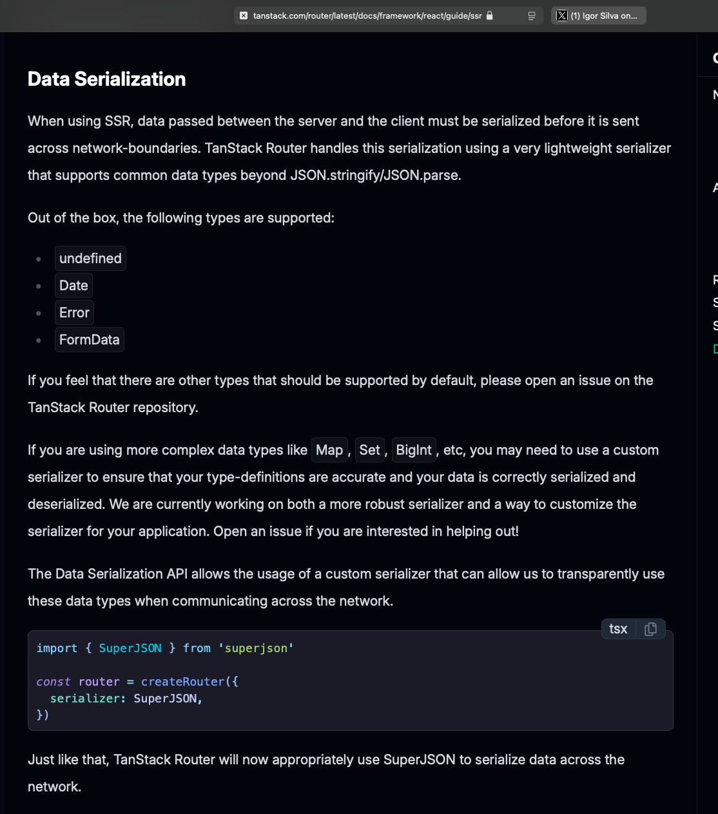

SuperJSON is a JSON serializer/deserializer that preserves richer JavaScript values than plain JSON.

This came from a TanStack docs suggestion and is relevant to our custom JSON/parser/BigInt handling. It is a candidate replacement for custom serialization around values that plain JSON loses or cannot represent cleanly, such as `Date`, `Map`, `Set`, `RegExp`, `BigInt`, `undefined`, and other non-plain JSON values.

Original reference: [Tom Doerr on SuperJSON](https://x.com/tom_doerr/status/1941117192453435431?s=12&t=fpfVVVXvGdro5tlVeroG9A)

