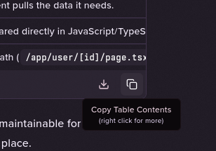
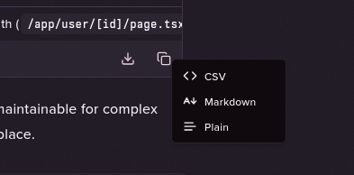

UX reference for visible care in chat UI polish.

just how much @t3dotchat cares about the UX. 

love t3 chat, Thanks @r_marked and @theo! https://t.co/LHMz8K09IK

## Source

- URL: https://x.com/aravindcm/status/1939902241047220560?s=12&t=fpfVVVXvGdro5tlVeroG9A
- Posted: July 1, 2025 (2025-07-01T04:21:50.000Z)
- Author: [@aravindcm](https://x.com/aravindcm) Aravind
- Metrics at scrape time: Likes: 136 | Retweets: 0 | Replies: 3 | Views: 59115 | Quotes: 1 | Bookmarks: 13

