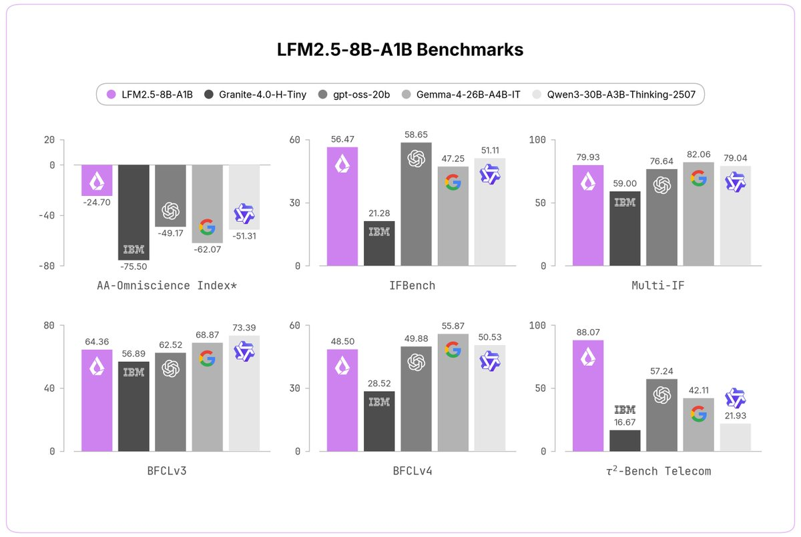

Add LFM2.5-8B-A1B support.

As of May 30, 2026, we did not find any provider hosting it yet.

## Source

[Liquid AI announced LFM2.5-8B-A1B on May 28, 2026](https://x.com/liquidai/status/2060023455290974474?s=12).

Raw scrape: [tweet-2060023455290974474.md](attachments/tweet-2060023455290974474.md)

Image backup:

The captured tweet describes it as:

- 8B MoE, 1.5B active
- 128K context
- LFM2.5 flagship hybrid MoE architecture
- trained on 38T tokens plus large-scale RL
- fast, reliable tool calling
- customizable on a single GPU for specialized tasks
- LFM2 open-weight license
