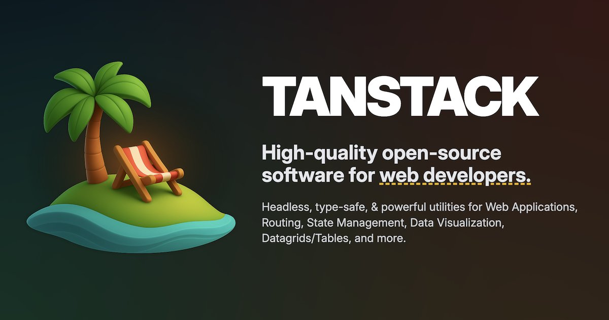

Consider using TanStack Virtual for our action list because it can get quite large.

The list does not feel heavy today, and the trade-offs are not obvious. This is not a rewrite request yet; first inspect the current action list behavior, measure or reason about the actual pressure, and decide whether virtualization is worth the complexity.

## Reference

TanStack Virtual now has first-class chat support: end anchoring, append-follow, stable prepends, and streaming messages that stay pinned when they should.

The modern web is now a lot of streaming UI on top of lists, so this needed to feel boring 😉
https://x.com/tan_stack/status/2058960433676251201?s=12

## Expanded source

Original URL: https://x.com/tan_stack/status/2058960433676251201?s=12

Raw scrape: [tweet-2058960433676251201.md](attachments/tweet-2058960433676251201.md)

Card image backup:



Tweet captured May 25, 2026. The source says TanStack Virtual added first-class chat support, including end anchoring, append-follow, stable prepends, and streaming messages that stay pinned when appropriate.

Author: [TANSTACK](https://x.com/tan_stack). Metrics at scrape time: 1,252 likes, 58 retweets, 24 replies, 257,684 views, 13 quotes, 859 bookmarks.

Why this mattered in the capture: list virtualization for chat/streaming UI is directly relevant to Meseeks surfaces that append, prepend, and stream action output.

## TickTick source

- Project: `Inbox (inbox118693896)`
- List tag: `ticktick-list:inbox`
- Task id: `6a152ba86cc3510d826902c3`
- Priority: `0`
- Created: `2026-05-26T05:12:08Z`
- Updated: `2026-05-28T17:10:31Z`
- Start: `2026-05-28T23:00:00Z`
- Sort order: `-9222855921721201000`

```json
{
  "importedAt": "2026-05-29",
  "tags": [
    "source:ticktick",
    "ticktick-list:inbox"
  ],
  "tickTick": {
    "taskId": "6a152ba86cc3510d826902c3",
    "parentTaskId": null,
    "projectId": "inbox118693896",
    "projectName": "Inbox",
    "columnId": null,
    "columnName": null,
    "title": "TanStack Virtual",
    "content": "TanStack Virtual now has first-class chat support: end anchoring, append-follow, stable prepends, and streaming messages that stay pinned when they should.\n\nThe modern web is now a lot of streaming UI on top of lists, so this needed to feel boring 😉\nhttps://x.com/tan_stack/status/2058960433676251201?s=12",
    "description": "",
    "notionBlockString": "",
    "status": 0,
    "deletionStatus": 0,
    "priority": 0,
    "progress": 0,
    "sortOrder": -9222855921721201000,
    "taskType": 0,
    "commentCount": 0,
    "tagString": "",
    "timeZone": "Europe/Lisbon",
    "startAt": "2026-05-28T23:00:00Z",
    "endAt": null,
    "createdAt": "2026-05-26T05:12:08Z",
    "updatedAt": "2026-05-28T17:10:31Z",
    "completedAt": null,
    "repeatRule": null,
    "repeatFrom": null,
    "repeatTaskId": null,
    "embeddedChildTaskIds": []
  },
  "children": [],
  "attachments": [],
  "checklistItems": [],
  "reminders": []
}
```
