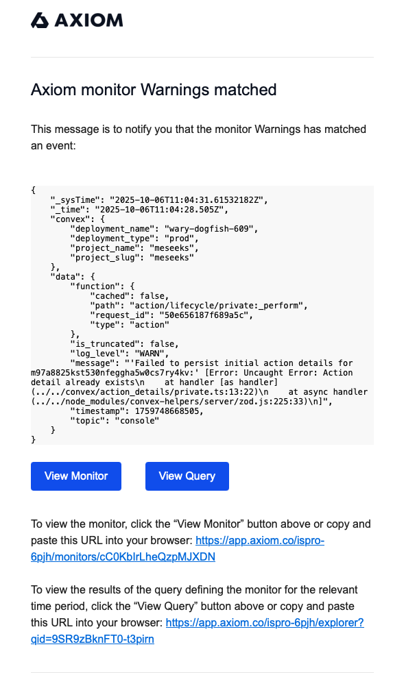

Common legacy error:

```txt
Failed to persist initial actions
```



## Attachments

- [a1a17cd5-dfb1-44b2-a03c-b40904ac7326.png](attachments/d07a80ed-a1a17cd5-dfb1-44b2-a03c-b40904ac7326.png) (127945 bytes)

## TickTick source

- Project: `🧞‍♂Meseeks (66b35a9a617f11216a574648)`
- List tag: `ticktick-list:meseeks`
- Task id: `68e9fda373fe9102d07a80e7`
- Column: `Inbox (66b9091be0871102361203fc)`
- Status tag: `ticktick-status:inbox`
- Priority: `5`
- Created: `2025-10-11T06:48:03Z`
- Updated: `2025-10-11T06:48:03Z`
- Sort order: `-9222798197222330000`

```json
{
  "importedAt": "2026-05-11",
  "tags": [
    "source:ticktick",
    "ticktick-list:meseeks",
    "ticktick-status:inbox"
  ],
  "tickTick": {
    "taskId": "68e9fda373fe9102d07a80e7",
    "parentTaskId": null,
    "projectId": "66b35a9a617f11216a574648",
    "projectName": "🧞‍♂Meseeks",
    "columnId": "66b9091be0871102361203fc",
    "columnName": "Inbox",
    "title": "Fix THAT",
    "content": "\n",
    "description": "",
    "notionBlockString": "",
    "status": 0,
    "deletionStatus": 0,
    "priority": 5,
    "progress": 0,
    "sortOrder": -9222798197222330000,
    "taskType": 0,
    "commentCount": 0,
    "tagString": "",
    "timeZone": "Europe/Lisbon",
    "startAt": null,
    "endAt": null,
    "createdAt": "2025-10-11T06:48:03Z",
    "updatedAt": "2025-10-11T06:48:03Z",
    "completedAt": null,
    "repeatRule": null,
    "repeatFrom": null,
    "repeatTaskId": null,
    "embeddedChildTaskIds": []
  },
  "children": [],
  "attachments": [
    {
      "taskId": "68e9fda373fe9102d07a80e7",
      "entityId": "68e9fda3baea5102d07a80ed",
      "filename": "a1a17cd5-dfb1-44b2-a03c-b40904ac7326.png",
      "localFilePath": "/Users/igor/Library/Group Containers/75TY9UT8AY.com.TickTick.task.mac/Attachments/61dba20a2d3051efd1f8a568/68e9fda373fe9102d07a80e7/a1a17cd5-dfb1-44b2-a03c-b40904ac7326.png",
      "referencedAttachmentId": "68e9fda3baea5102d07a80ed",
      "fileSize": 127945,
      "fileType": 1,
      "status": 0,
      "createdAt": "2025-10-11T06:48:03Z",
      "updatedAt": null,
      "importedFileName": "d07a80ed-a1a17cd5-dfb1-44b2-a03c-b40904ac7326.png",
      "importedRelativePath": "attachments/d07a80ed-a1a17cd5-dfb1-44b2-a03c-b40904ac7326.png",
      "importedSourcePath": "/Users/igor/Library/Group Containers/75TY9UT8AY.com.TickTick.task.mac/Attachments/61dba20a2d3051efd1f8a568/68e9fda373fe9102d07a80e7/a1a17cd5-dfb1-44b2-a03c-b40904ac7326.png",
      "importStatus": "copied"
    }
  ],
  "checklistItems": [],
  "reminders": []
}
```
