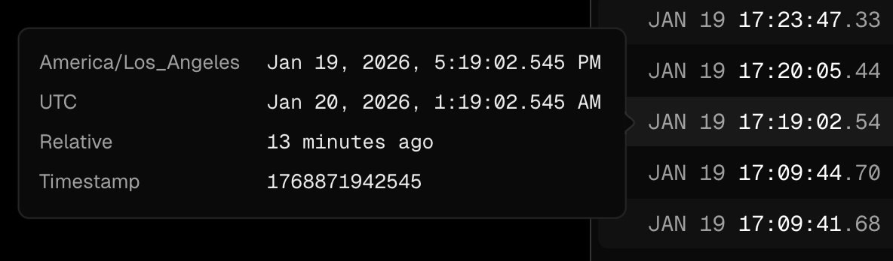

Improve our timestamp hover to show multiple useful timezones.

We already have a custom hover on timestamps, but Lee Robinson's Vercel reference is cleaner: relative timestamps like `25d ago` reveal both UTC and the viewer's local timezone on hover.

Reference:

- [Lee Robinson timestamp hover](https://x.com/leeerob/status/1863025501264081275?s=12&t=fpfVVVXvGdro5tlVeroG9A): small quality-of-life timestamp UI for Vercel.
- [Rhys Sullivan timestamp popup](https://x.com/RhysSullivan/status/2013424573333561594?s=20): stronger popup reference for showing a precise timestamp from a compact relative time.

