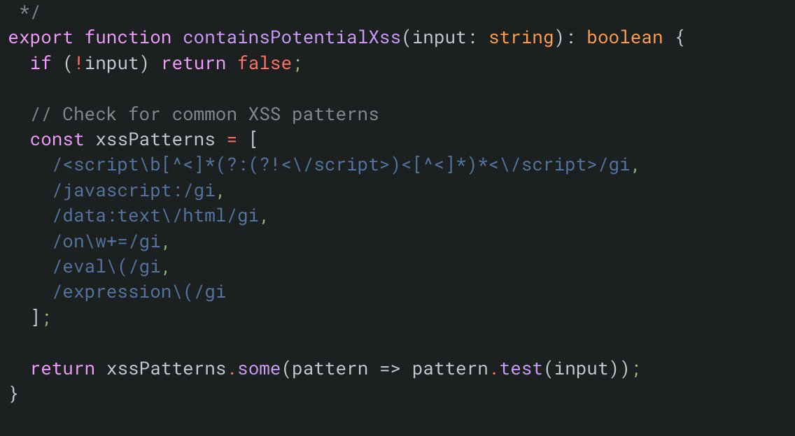

# Make MDX Safe

Meseeks renders user/model-generated Markdown and MDX in multiple places. That is useful, but unsafe rendering can become a prompt-injection, data-exfiltration, or stored-XSS surface.

The old private task said we could turn MDX off and use plain Markdown until we have a safe rendering model. The later markdown sanitizer reference reinforces the same point: generated Markdown may need sanitization before it is rendered by another system, and Markdown-to-Markdown sanitization is brittle because parsers disagree.

## Objective

Make generated Markdown/MDX rendering safe enough for public use without losing the ability to show rich task/action output when we intentionally allow it.

## Subtasks

- [ ] Audit every Markdown/MDX render sink in Meseeks and Organizer.
- [ ] Separate plain Markdown rendering from trusted MDX/component rendering.
- [ ] Default untrusted task/action content to safe Markdown.
- [ ] Add URL-scheme validation for links and images.
- [ ] Add a lightweight preflight guard for obvious XSS payloads before content reaches compile/render paths.
- [ ] Decide whether trusted MDX needs a sandbox, compiler allowlist, or removal.
- [ ] Preserve a clear fallback path: show raw content when rendering is blocked or fails.
- [ ] Add regression fixtures for prompt-injection and renderer-ambiguity cases.

## Current Code Context

- `apps/meseeks/src/hooks/useMDX.tsx` compiles text with `@mdx-js/mdx` and runs it in the browser runtime.
- `apps/meseeks/src/components/ui/mdx.tsx` is the shared Meseeks renderer.
- `apps/meseeks/src/components/actions/GenericAction.tsx` renders small generic action results as MDX.
- Organizer has separate MDX rendering paths called out in the DeepSec scan.

## Potential XSS Preflight Reference

This is only a smoke guard for obvious payloads. It should complement the safe MDX/Babel work, not replace AST allowlists, sandboxing, URL validation, or plain Markdown fallback.

Likely code paths:

- `apps/meseeks/convex/babel.ts`
- `apps/meseeks/skills/builtIn/render.ts`
- `apps/meseeks/src/hooks/useMDX.tsx`



Transcription from the reference:

```ts
export function containsPotentialXSS(input: string): boolean {
	if (!input) return false;

	// check for common xss patterns
	const xssPatterns = [
		/<script\b[^<]*(?:(?!<\/script>)<[^<]*)*<\/script>/gi,
		/javascript:/gi,
		/data:text\/html/gi,
		/on\w+=/gi,
		/eval\(/gi,
		/expression\(/gi,
	];

	return xssPatterns.some((pattern) => pattern.test(input));
}
```

## Sources

- Original TickTick task `675b4ccbfcc7119027e76e4e`, "Make MDX safe".
- TickTick task `689265aada81d119afb4748c`, "markdown-to-markdown-sanitizer".
- TickTick task `67f7d8afb230d111b3a5f513`, "containsPotentialXSS".
- Original ChatGPT source: https://chatgpt.com/share/67741300-98b4-8013-98d5-5793aa865fe6
- Public reference: https://github.com/holocron-hq/safe-mdx
- Public reference: https://github.com/developit/workerize
- Public reference: https://x.com/aidenybai/status/1873444625907597780
- Public reference: https://x.com/cramforce/status/1952783609846448350
- Related scan reference: [DeepSec vulnerability scan](../../references/deepsec-vulnerability-scan/_index.md)
