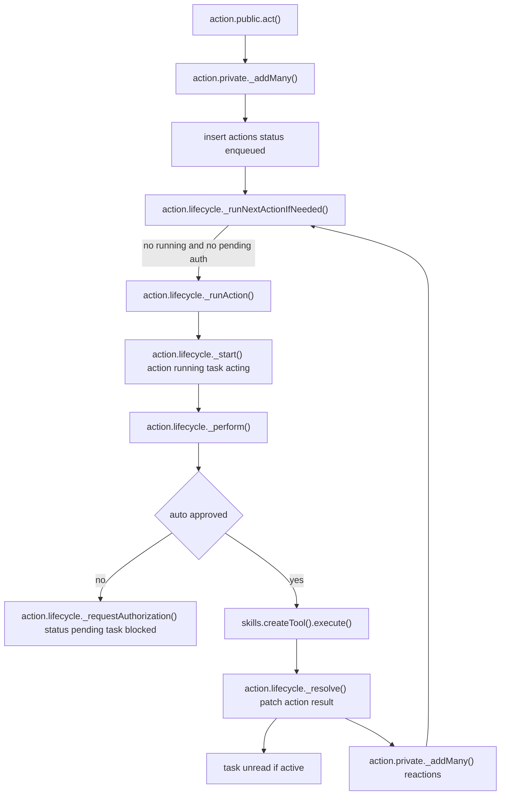
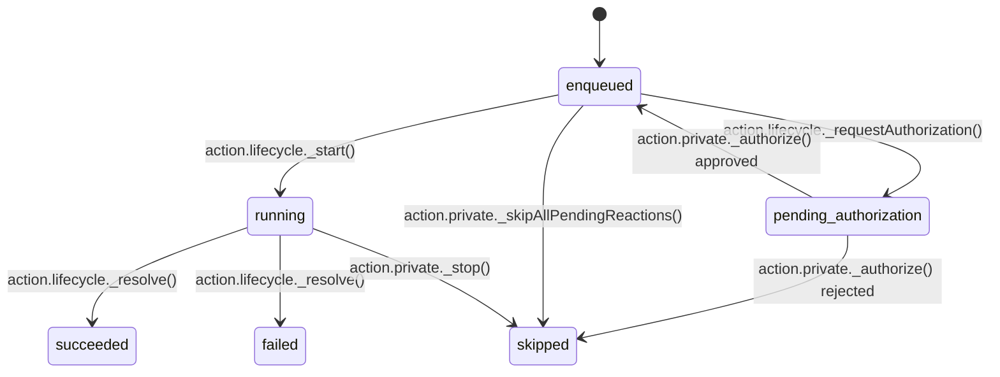
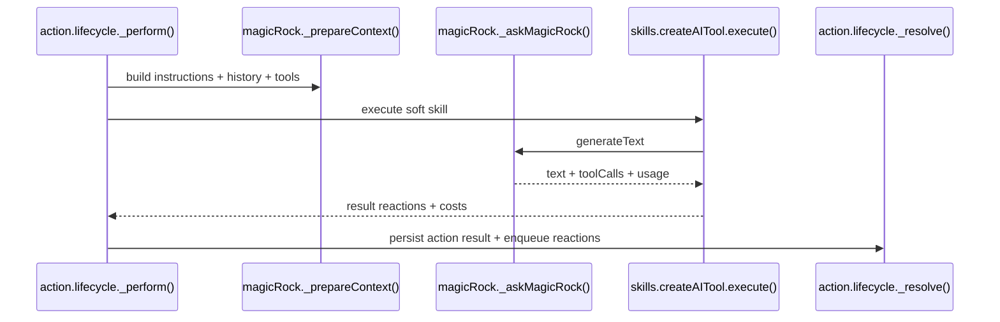

# Current Action Execution Model (Implementation Notes)

This document describes the current, shipping execution model exactly as implemented in the codebase. It is a factual map of today’s behavior and is anchored to specific files and functions.

This is a Reactor v1 source reference. It describes the current/v0 implementation and may be stale as the new Reactor replaces the old path.

## Scope

- Backend execution model in Convex: action creation, queueing, execution, reactions, authorization, budgeting.
- Skill execution paths (soft / hard / built-in).
- Context building and action detail logging.
- Task and action status transitions.

## Core Entities and Schemas

### Action (`convex/schemas/actionSchema.tsx`)

Key fields (simplified):
- `taskId`, `owner`, `author`, `skillKey`, `args`, `depth`
- `status`: `enqueued`, `running`, `pending authorization`, `succeeded`, `failed`, `skipped`
- `result`: `{ text?, reactions: newActionSchema[] }` for resolved actions
- `costs`: array of `{ symbol, amount, description }` for resolved actions
- `estimatedCost`, `approvedAt`, `approvedBy`

Notes:
- `author` is a union: user id or action id.
- `depth` increments per reaction chain.
- `newActionSchema` is used as the reaction payload structure.

### Task (`convex/schemas/taskSchema.tsx`)

Key fields:
- `status`: `idle`, `acting`, `unread`, `blocked`, `discarded`, `done`
- `isActive`: derived from status (not `done` or `discarded`)
- `energyBudget`: `{ total, available }`
- `availableSkills`: list of skill keys used by soft skills for tool availability
- `lastUpdatedAt`: updated by `_updateInstructions`

### Skill (`convex/schemas/skillSchema.tsx`)

Kinds:
- `built-in`
- `hard` (HTTP tool)
- `soft` (LLM decision tool)

Common fields:
- `key`, `description`, `inputSchema`, `preApprovedCost`, `knownReactions`, `priority`

### Action Detail (`convex/schemas/actionDetailSchema.tsx`)

Stored in `action_details` table for soft/hard skills only:
- Soft: model info, system instructions, history, tools, tool calls, usage
- Hard: HTTP request/response details (sanitized)

## Entry Points (Public APIs)

### `convex/action/public.ts`
- `act`: creates one or more actions for a task (depth 0, author=owner).
- `authorize`: human approval/rejection for pending authorization actions.
- `findAllPaginated`, `findAllRunning`, `findOne`: query utilities.

### `convex/tasks/private.ts`
- `_add`: creates a new task and immediately enqueues actions (default includes `say` and optional `increaseBudget`).
- `_addWithActions`: creates task and enqueues provided skills.

## Action Creation and Queueing

### `_addMany` (`convex/action/private.ts`)

Steps:
1) Load task (`_findOneTask`).
2) If `author === owner` (human), call `_skipAllPendingReactions` to skip companion actions and stop running ones.
3) If task is inactive and `shouldReopen`, insert a `reopen` skill at the front.
4) Insert each action with:
   - `status: 'enqueued'`
   - `result: null`
5) Call `_runNextActionIfNeeded` to start execution.

Related helpers:
- `_add`: thin wrapper for adding a single action.
- `_skipAllPendingReactions`: marks pending companion actions as `skipped`; optionally calls `_stop` to cancel a running action.

## Queue Runner (Single-Action Execution)

### `_runNextActionIfNeeded` (`convex/action/lifecycle/private.ts`)

Execution gate:
1) If any action is `running`, return.
2) If any action is `pending authorization`, return.
3) Otherwise, take the next `enqueued` action and call `_runAction`.

### `_runAction`
- Calls `_start` to set action `running` and task `acting`.
- Uses `ctx.scheduler.runAfter(0, _perform)` to execute asynchronously.

## Action Execution Pipeline

### `_perform` (`convex/action/lifecycle/private.ts`)

High-level steps:
1) `_load`: fetch task, action, and skill definition.
2) If soft skill: `_prepareContext` (MagicRock) to build system+history+tools.
3) `_persistInitialActionDetails` (soft/hard only).
4) `_ensureWithinBudget` and `estimateCostFor`.
5) Auto-approval via `_tryAutoApprove`; if not approved, `_requestHumanApproval` and exit.
6) `createTool` → `tool.execute(args)` → `{ result, costs }`.
7) `_setResolved` → `_resolve` mutation.
8) `finally`: `_runNextActionIfNeeded`.

Timeout:
- Execution is wrapped in a `Promise.race` with a 590s timeout to avoid Convex action limits.

### `_resolve`
- Validates action exists and is not already resolved.
- Skips if action status is already `skipped`.
- Applies costs via `_useFunds` (if succeeded and cost > 0).
- Patches action with `result`, `status`, `costs`.
- If task is active:
  - Sets task `status` to `unread`.
  - Enqueues all reactions using `_addMany` with `author = action._id` and `depth + 1`.

## Authorization Flow

### Auto-approval (`_tryAutoApprove`)

Rules:
- If `action.author === task.owner`, auto-approve.
- Else, check `preApprovedCost`:
  - If `none` or less than expected cost → require human approval.
- Reject auto-approval if too many consecutive companion actions:
  - `_hasReachedMaxConsecutiveCompanionActions` uses `env.MAX_CONSECUTIVE_COMPANION_ACTIONS`.

### Human approval

- `_requestAuthorization`: sets action status to `pending authorization`, task to `blocked`.
- `authorize` mutation calls `_authorize`:
  - Approved → status remains `running` or becomes `enqueued`.
  - Rejected → status `skipped`, result `{ text: "rejected by ...", reactions: [] }`.
  - If rejected: task status set to `idle`.
  - Always calls `_runNextActionIfNeeded`.

## Reactions and Depth

### Reaction creation

Built-in + hard skills:
- `createReactions` (`convex/skills/createReactions.ts`) filters by condition:
  - `owner`: only if `action.author === action.owner`
  - `companion`: only if `action.author !== action.owner`
  - `any`: always
- Produces a new action payload with:
  - `taskId`, `owner`, `author = action._id`, `depth = action.depth + 1`

Soft skills:
- `createAITool` builds reactions directly from model tool calls (currently only the first tool call).

### Reaction scheduling

Reactions are scheduled in `_resolve` via `_addMany`.
There is no additional reaction arbitration; each action’s reaction list is enqueued immediately if the task is active.

## Skill Execution Paths

### Built-in skills (`convex/skills/createBuiltInTool.ts`)

- Built-in skills are defined in `convex/skills/builtIn/*.ts` and aggregated in `convex/skills/builtIn/index.ts`.
- `createBuiltInTool` executes the skill’s `use` function and applies `createReactions`.
- Costs are always zero.

### Hard skills (HTTP) (`convex/skills/createHttpTool.ts`)

- Builds HTTP request from `skill.config` and `paramMappings`.
- Persists response metadata into `action_details`.
- If HTTP response is not OK, throws error.
- On success: returns `{ text?, reactions: createReactions(action, skill.knownReactions) }`.

### Soft skills (LLM) (`convex/skills/createAITool.ts`)

Execution behavior:
- Calls `_askMagicRock` with context from `_prepareContext`.
- Reads `toolCalls`, `finishReason`, `text`, `usage`, `warnings`.
- Tool-call handling:
  - If `finishReason` is `tool-calls`, uses only the first tool call.
  - If `finishReason` is `stop` or `error`, emits a `say` reaction.
  - Multiple tool calls are logged with a warning and ignored (only first used).
- Persists LLM execution details into `action_details`.
- Costs are computed from provider pricing + `env.ACTION_COST_USD`.

## MagicRock Context Building (Soft Skills)

### `_prepareContext` (`convex/magicRock.tsx`)

Components:
- `renderHistory`: uses `_findLastActions` and converts actions into XML-like messages.
- `loadTools`: collects allowed tools based on `skill.config.availableSkills`, with support for `{{taskSkills}}`.
- `renderInstructions`: expands instruction variables (task, user info, schedules, ancestors, etc).

Important runtime settings:
- `toolChoice: 'required'`
- `maxSteps: 1`
- `parallelToolCalls: false`
- History is cropped to `MAX_CONTEXT_TOKENS`.

History rendering:
- Includes only actions with status `succeeded`, `failed`, or `pending authorization`.
- Skips the current action.
- Uses `action.result?.text` for history content.

## Budget and Cost Accounting

### Estimation and gating
- `estimateCostFor` (soft skills) uses context length to estimate tokens.
- `_ensureWithinBudget` throws `NotEnoughBudget` if estimated cost exceeds available budget.

### Usage
- `_useFunds` subtracts from task budget on success.
- `_increaseBudget` adds funds if user balance is sufficient.

## Task Status Transitions (Current Behavior)

- `_start` → task `acting`
- `_requestAuthorization` → task `blocked`
- `_resolve` (when task active) → task `unread`
- `_authorize` (rejected) → task `idle`
- `_markAsRead` → task `idle` (from `unread` or `blocked`)
- `_setStatus` → `isActive` toggles based on `done` / `discarded`

## Action Details Logging

### `action_details` table

- Created in `_persistInitialActionDetails` (soft/hard only).
- Updated after execution by:
  - `createAITool` → LLM results (tool calls, usage, warnings).
  - `createHTTPTool` → HTTP response details.

## Concurrency and Scheduling

- Only one action per task can run at a time (`_runNextActionIfNeeded` checks for running actions).
- If any action is `pending authorization`, no new actions start.
- Reactions are enqueued immediately as separate actions and run sequentially.

## Mermaid Diagrams

### Action Lifecycle (Queue + Execution)

### Action Status State Machine

### Soft Skill Execution (LLM)

