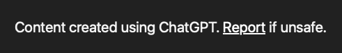

Add a visible report warning on shared Meseeks surfaces.

The warning should make it clear that shared content may be user-created or AI-created, and that users can report it if it looks unsafe.

Reference direction:

Keep the copy compact. This is trust and safety affordance, not a modal nobody reads.
