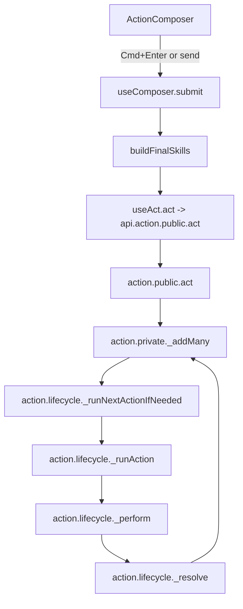
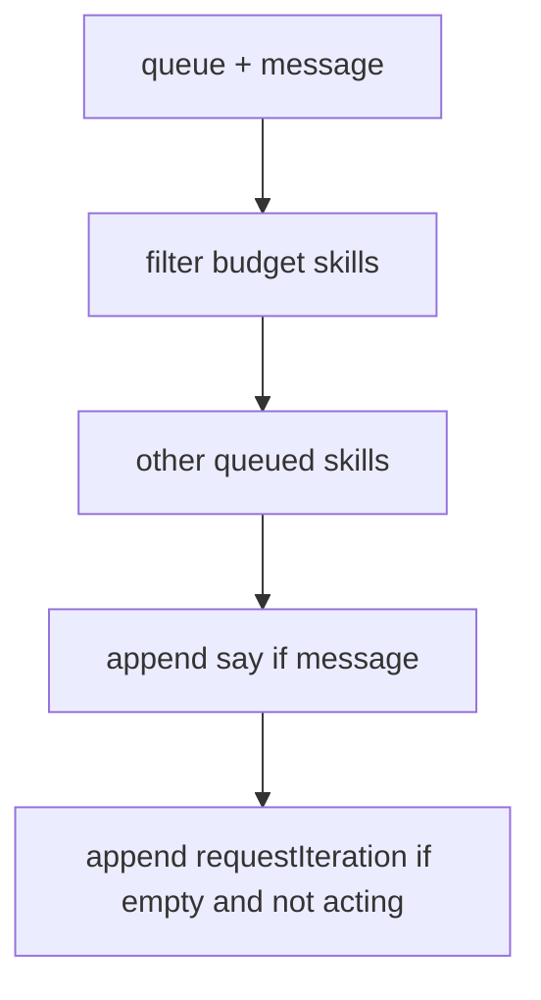
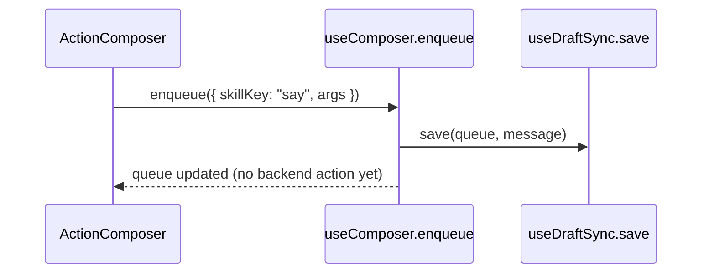
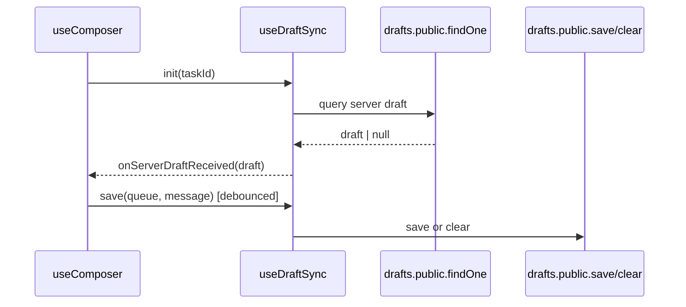
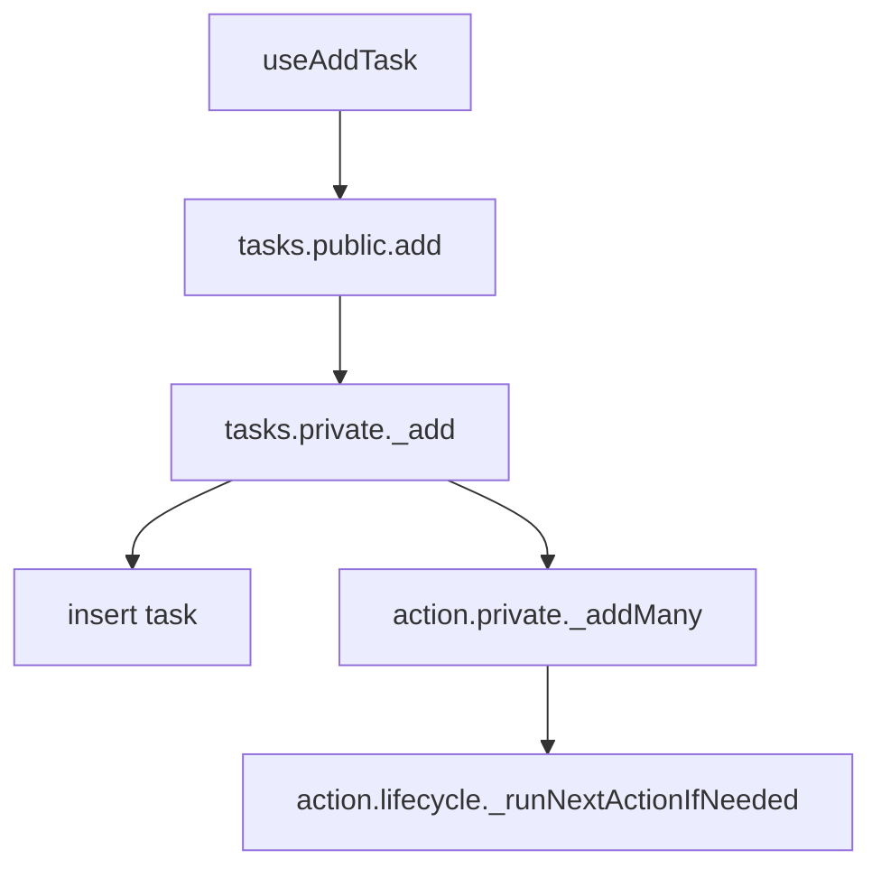
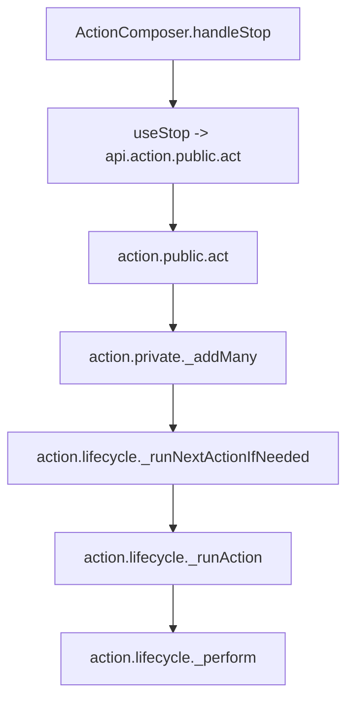
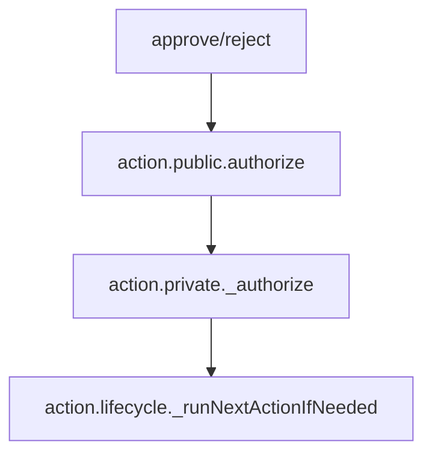
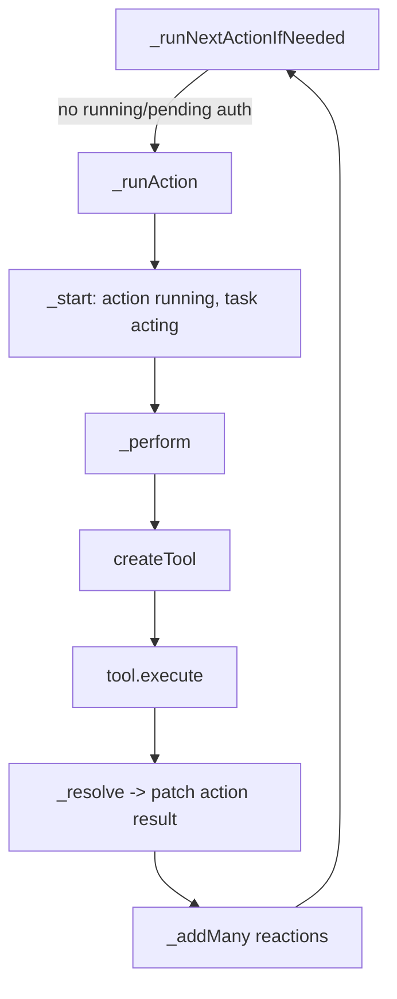
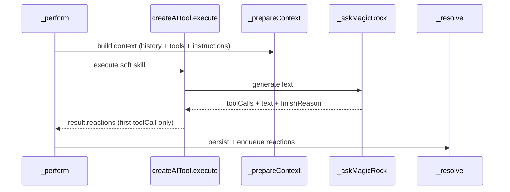

# Action Execution Flows (UI -> Backend)

This file is flow-only: UI entry points, data flow, and backend execution paths as they exist today.

This is a Reactor v1 source reference. It describes the current/v0 implementation and may be stale as the new Reactor replaces the old path.

## UI Composer -> act() (existing task)

Key files:
- `src/components/ActionComposer/ActionComposer.tsx`
- `src/hooks/useComposer.tsx`
- `src/hooks/useAct.ts`
- `convex/action/public.ts`
- `convex/action/private.ts`
- `convex/action/lifecycle/private.ts`

### Composer submission flow

### Skill list construction (current ordering)

`useComposer.buildFinalSkills` (`src/hooks/useComposer.tsx`)
1) Budget skills first: `increaseBudget`, `decreaseBudget`
2) Other queued skills
3) `say` from message (if present)
4) If empty and task not acting: `requestIteration`

### Enqueue-only flow (Alt+Enter)

## Draft sync (Composer)

Key files:
- `src/hooks/useDraftSync.ts`
- `convex/drafts/public.ts`
- `convex/drafts/private.ts`

## New task creation -> initial actions

Key files:
- `src/hooks/useTaskMutations.ts` (useAddTask)
- `convex/tasks/public.ts` (add)
- `convex/tasks/private.ts` (_add)
- `convex/action/private.ts` (_addMany)

## Stop acting (Ctrl+C)

Key files:
- `src/components/ActionComposer/ActionComposer.tsx`
- `src/hooks/useTaskMutations.ts` (useStop)
- `convex/action/public.ts` (act)
- `convex/action/private.ts` (_addMany, _stop)

## Approve / Reject pending authorization

Key files:
- `src/hooks/useTaskMutations.ts` (useApproveAction, useRejectAction)
- `convex/action/public.ts` (authorize)
- `convex/action/private.ts` (_authorize)
- `convex/action/lifecycle/private.ts` (_runNextActionIfNeeded)

## Backend execution path (common continuation)

Key files:
- `convex/action/lifecycle/private.ts`
- `convex/skills/tools.ts`
- `convex/skills/createBuiltInTool.ts`
- `convex/skills/createHttpTool.ts`
- `convex/skills/createAITool.ts`

## Soft skill tool call flow (LLM)

Key files:
- `convex/skills/createAITool.ts`
- `convex/magicRock.tsx`

