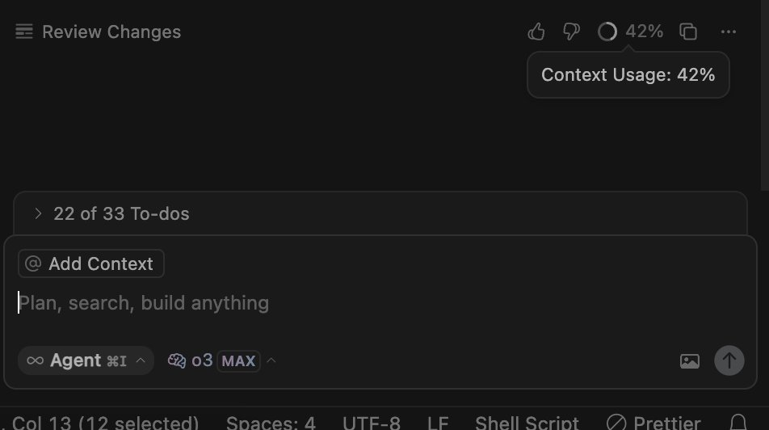
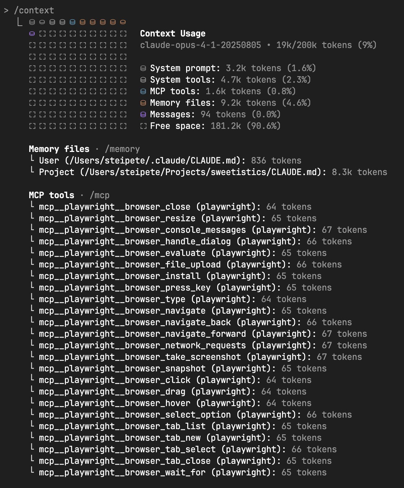

The current direction is intentionally exploratory. We have made progress on both Launcher and Composer, but the final shape is not settled.

The likely product direction is not a literal merge at all costs. Composer may become one Launcher mode in some contexts, while still having a dedicated task-level surface in others. On mobile, the newer vision is closer to a Versa-style floating tab/button bar with fast entry points for:

- Composer
- Launcher in search mode
- Launcher/task-detail mode

On desktop, the right answer may be different. Keep iterating against the real UI instead of forcing the old “unify Cmd+J and Cmd+I” framing too early.

## Current code context

- `apps/meseeks/src/components/ActionComposer/ActionComposer.tsx` has a task-contained Composer with strips, voice input, queueing, and shortcuts.
- `apps/meseeks/src/hooks/useComposer.tsx` already supports a queue up to 16 actions, draft sync, pending submitted actions, budget/energy queueing, and final skill ordering.
- `apps/meseeks/src/components/Launcher/LauncherDialog.tsx` is still a search/command dialog with paginated task loading and mobile current-task detail rendering.

## Open design questions

- Should Composer be a Launcher mode everywhere, or only when no task-level Composer is visible?
- Should task-level Composer become a floating surface instead of an anchored bottom panel?
- How should mobile navigation expose Composer, search, and task detail without making them feel like unrelated entry points?
- How should queued actions, energy changes, skill selection, and “regular task app” behavior be represented without adding clutter?
- How should shortcuts evolve from `Cmd+J`, `Cmd+I`, `Cmd+K`, and skill/loop switching once the UI settles?

## Merged scope

- Composer/Launcher mode and shortcut model.
- Mobile floating navigation for Composer, search, and task detail.
- Multi-action Composer queue.
- Energy controls in or near the Composer.
- Submit button state that reflects how many actions will run.
- Optional reaction suppression so Composer can behave like a regular task app.
- Quick actions, pinned tasks, skill/loop switching, and skill selection.
- Composer undo behavior.
- Launcher pasted-resource matching: if I paste an existing resource path like `/task/kh71mzvz3bb7d42nyzadxx7v89845ea2`, the Launcher should recognize it as a task, load the task details inline, and navigate there on Enter/Return.
- Visual references for richer Composer controls.
- Detailed context usage: show a polished breakdown of what is consuming the context window, how much remains, and enough detail to make pruning or energy decisions obvious.

## Original notes

I’ve been thinking about our keyboard shortcuts (global and contextual). While using other AI apps, I’ve been paying extra attention to the small UX details and trying to abstract patterns we can borrow. Even though Meseeks is “simpler” in terms of how we represent information, I feel like our shortcut system is already more complex than it should be.

That said, we’re at v0—we shouldn’t over-optimize abstractions yet. But I do have a few UX insights I’d like us to explore.

First: unify Cmd+J and Cmd+I.

Today we have:

- A global shortcut (Cmd+J) that navigates to a `/new` route which renders the Composer (`ActionComposer`). It’s basically an empty screen with the composer so you can start a task. At that moment, we don’t have a task yet.
- When we’re inside a task, we have Cmd+I that moves focus into the Composer input. Once focused, there are other composer-specific shortcuts (not important right now, but important context).

What I’m thinking is: this should all be Cmd+I.

The desired behavior:

- If a Composer is visible in the current UI, Cmd+I should focus it.
- If a Composer is NOT visible, Cmd+I should open the Launcher in “Composer mode” (a floating Composer, similar to how we open the Launcher today).

Important nuance: sometimes we may be within a task context, but still not see a Composer (e.g., I’m two or three levels deep in attachments, or I’m in a full-screen composition). Even in that situation:

- If there isn’t a visible Composer to focus/attach to, we still open the Launcher (in Composer mode).
- When we do, the current task should appear as an “attachment strip” above the input field (like Cursor and other AI tools do): a smaller context line that can show a few compact blocks of information (task context, key actions, the most relevant shortcuts, maybe a smart “completion bar” like phone keyboards).
- This same pattern should apply anywhere the Launcher + Composer exists.

Raycast analogy:

- Raycast has a global command (Cmd+K) that opens their launcher.
- In Raycast, you can hit Tab to enter AI mode from the launcher.

We could do something similar:

- Cmd+K opens our Launcher.
- If the Launcher input is empty, pressing Tab switches into “Composer mode” (i.e., show the Composer).
- Separately, Cmd+I should open the Launcher already in Composer mode, focused and ready to type.
- I should be able to use keyboard shortcuts to back out of the Composer while staying inside the Launcher.

So overall: I want us to unify the Launcher + Composer experience and align keyboard shortcuts around that.

Longer-term context about the Composer:

- The current Composer is much simpler than what it’s supposed to be. Right now it basically runs a “say” action.
- But the Composer is meant to run any skill in the system (skills are actions; eventually “skills are loops,” but we haven’t introduced loops yet).
- The UI should adapt to device/context: maybe single-line on mobile, expanding to multiple lines as needed; and similarly on desktop (like ChatGPT).
- It should support changing which skill will run, but it shouldn’t be a big, distracting control. More like Cursor’s bottom-left indicator—except I don’t like the word “mode.” Conceptually it’s “which skill you’re running.”

Drafts vision (slack-like) - medium term TODOs:

- Persist composer drafts server-side per task (message, queued skills, collapsed strips)
- Cross-device continuity: open same task on phone/desktop and keep the same draft automatically
- Add a global "Drafts" surface showing unsent drafts across tasks, with quick jump-to-task
- Define sharing semantics for drafts: personal by default, explicit "Share draft link" action when needed

One critical interaction:

- While focused in the Composer, if I keep pressing Cmd+I (the same shortcut that brings me there), it should rotate between my Quick Actions (skills + pre-filled or placeholder args).

Default target / task creation behavior:

- In a global context (outside anything), the Launcher + Composer should default to targeting a “new task” (this should be implied or visibly indicated).
- If I run an action and there is no attached task (i.e., no task ID provided), the system should create a new empty task (like an empty email draft: untitled, just an ID) and then attach/insert the action into it.
- This should be reflected in the backend API design: keep the “create task” API (it’s fine and useful), but the primary UI flow should often be “add action” where “add action without a parent task ID” creates the task and returns it (or at least returns the new task ID) along with the action association. "Create task" creates empty tasks.

Budget/energy balance idea:

- Right now, when we start a task, we run an “increase budget” action and then a “say” action, which triggers a reaction chain.
- I want budget adjustments to be more native: any action should be able to add budget (and we can still have explicit actions for removing budget).
- The Composer should eventually represent this capability. Today we also have a task budget component showing total spent, and final cost when the task closes. That might eventually live near the Composer, but I don’t want to take on that complexity right now—just keep it in mind and suggest an approach.

That’s it.

## Merged TickTick source notes

These duplicate/imported tasks were merged into this parent so the task list has one place for Composer/Launcher iteration. Keep the original IDs for traceability.

- `67efb88c2db51172d7d5f3cd`: Composer support for multiple actions. Original note: tapping increase budget should add an action to the Composer instead of performing immediately, so submit sends more than one action.
- `69ee3580d94c9102ba61e1e9`: Submit button should show a count when submission will run multiple actions, up to 16.
- `691f6c4facf9d102be0e5e9d`: Energy should be at the ActionComposer.
- `684efeafa2891169239983fe`: Composer warning for low budget.
- `68001d46dbc29146a164245a`: Let me turn off reactions on the Composer so it can work as a regular task app.
- `67d331d6da09113d25d855bc`: Quick Actions and Pinned Tasks.
- `68dbfbec14369102a90916ef`: Visual reference for Action Composer controls. Attachment preserved at [action-composer-reference-a90916f5.png](attachments/action-composer-reference-a90916f5.png).
- `698fbd72098551067f63bb61`: ActionComposer should have strong Cmd+Z support.
- `68af5511ce28d16b1eaa453f`: A queue action system like Cursor.
- `67efb8802deb1172d7d5f392`: Cmd+. to switch skill/loop.
