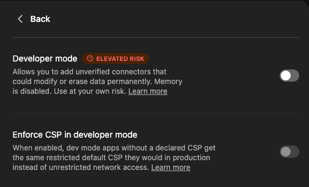

## Context

Reference for how ChatGPT handles security around Apps/connectors and warns about unverified connectors.

This is not a Meseeks implementation task by itself. Use it as product/security context when designing Meseeks app or skill integration trust boundaries.



## Attachments

- [9ce0613b-e7fc-4ced-9c75-8dfa48aa4adc.png](attachments/ba622480-9ce0613b-e7fc-4ced-9c75-8dfa48aa4adc.png) (32565 bytes)

## TickTick source

- Project: `🧞‍♂Meseeks (66b35a9a617f11216a574648)`
- List tag: `ticktick-list:meseeks`
- Task id: `69f0b621bf8b1102ba62247a`
- Column: `Inbox (66b9091be0871102361203fc)`
- Status tag: `ticktick-status:inbox`
- Priority: `3`
- Created: `2026-04-28T13:29:05Z`
- Updated: `2026-05-02T06:27:08Z`
- Sort order: `-9223114402801684000`

```json
{
  "importedAt": "2026-05-11",
  "tags": [
    "source:ticktick",
    "ticktick-list:meseeks",
    "ticktick-status:inbox"
  ],
  "tickTick": {
    "taskId": "69f0b621bf8b1102ba62247a",
    "parentTaskId": null,
    "projectId": "66b35a9a617f11216a574648",
    "projectName": "🧞‍♂Meseeks",
    "columnId": "66b9091be0871102361203fc",
    "columnName": "Inbox",
    "title": "security chatgpt",
    "content": "this is for `Apps`.\nThey allow devs to use \"unverified\" connectors.\n\n",
    "description": "",
    "notionBlockString": "",
    "status": 0,
    "deletionStatus": 0,
    "priority": 3,
    "progress": 0,
    "sortOrder": -9223114402801684000,
    "taskType": 0,
    "commentCount": 0,
    "tagString": "",
    "timeZone": "Europe/Lisbon",
    "startAt": null,
    "endAt": null,
    "createdAt": "2026-04-28T13:29:05Z",
    "updatedAt": "2026-05-02T06:27:08Z",
    "completedAt": null,
    "repeatRule": null,
    "repeatFrom": null,
    "repeatTaskId": null,
    "embeddedChildTaskIds": []
  },
  "children": [],
  "attachments": [
    {
      "taskId": "69f0b621bf8b1102ba62247a",
      "entityId": "69f0b621a3ab9102ba622480",
      "filename": "9ce0613b-e7fc-4ced-9c75-8dfa48aa4adc.png",
      "localFilePath": "/Users/igor/Library/Group Containers/75TY9UT8AY.com.TickTick.task.mac/Attachments/61dba20a2d3051efd1f8a568/69f0b621bf8b1102ba62247a/9ce0613b-e7fc-4ced-9c75-8dfa48aa4adc.png",
      "referencedAttachmentId": "69f0b621a3ab9102ba622480",
      "fileSize": 32565,
      "fileType": 1,
      "status": 0,
      "createdAt": "2026-04-28T13:29:05Z",
      "updatedAt": null,
      "importedFileName": "ba622480-9ce0613b-e7fc-4ced-9c75-8dfa48aa4adc.png",
      "importedRelativePath": "attachments/ba622480-9ce0613b-e7fc-4ced-9c75-8dfa48aa4adc.png",
      "importedSourcePath": "/Users/igor/Library/Group Containers/75TY9UT8AY.com.TickTick.task.mac/Attachments/61dba20a2d3051efd1f8a568/69f0b621bf8b1102ba62247a/9ce0613b-e7fc-4ced-9c75-8dfa48aa4adc.png",
      "importStatus": "copied"
    }
  ],
  "checklistItems": [],
  "reminders": []
}
```
