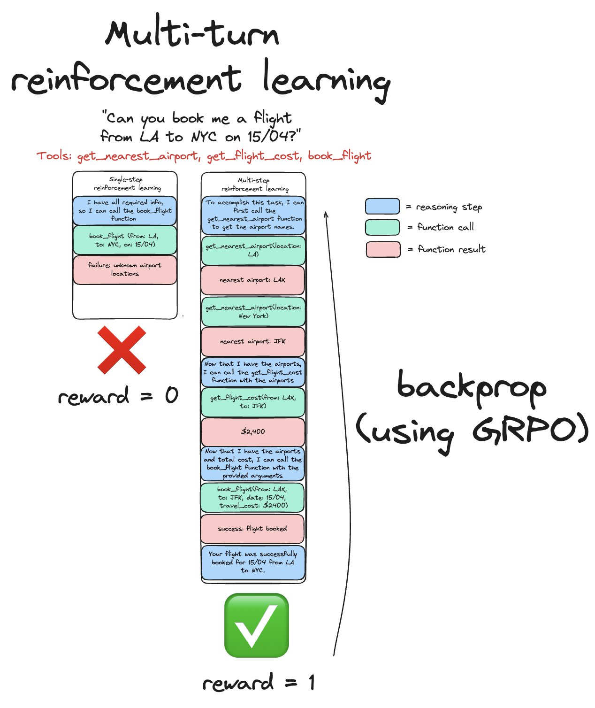

Add support for fine-tuning a model per user using that user's own data.

## References

- Unsloth Qwen3 fine-tuning: https://x.com/unslothai/status/1918335648764989476?s=12&t=fpfVVVXvGdro5tlVeroG9A

